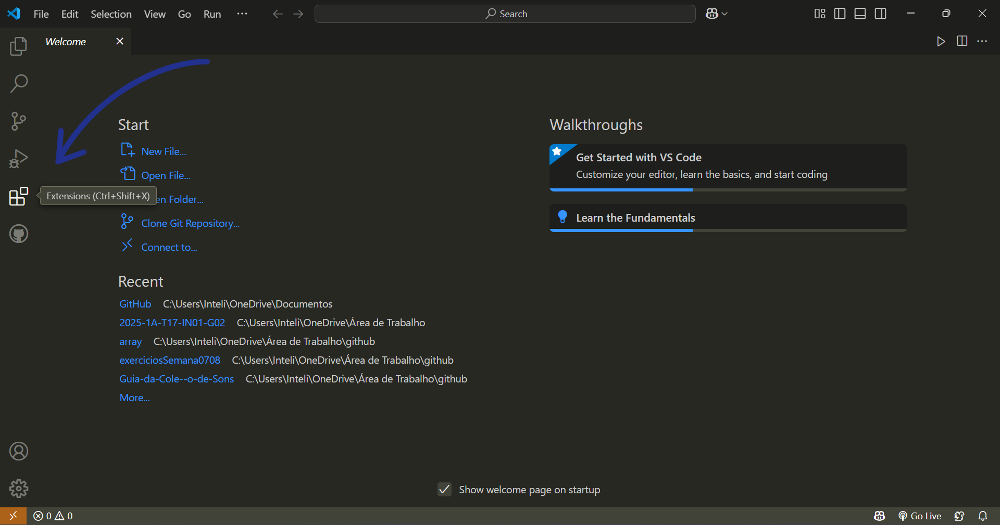
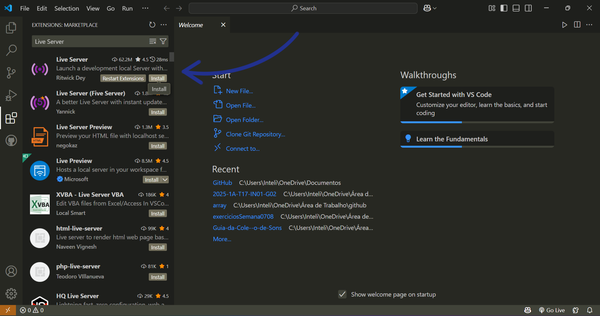
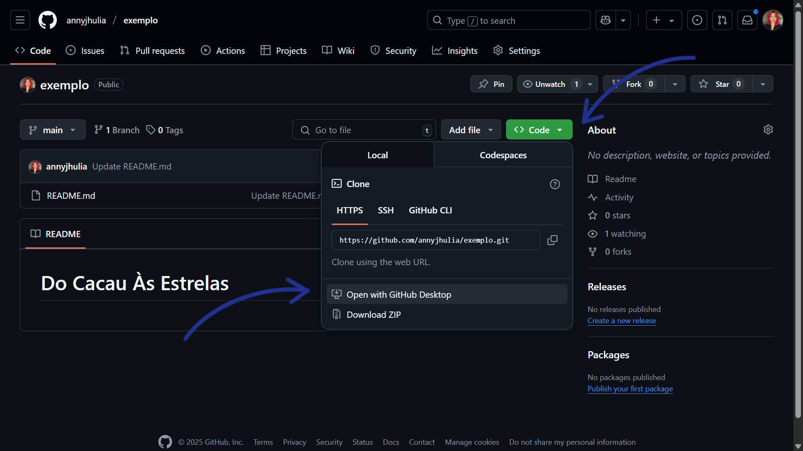
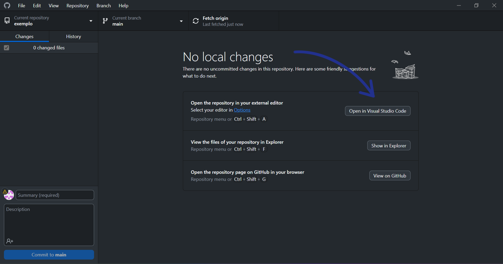
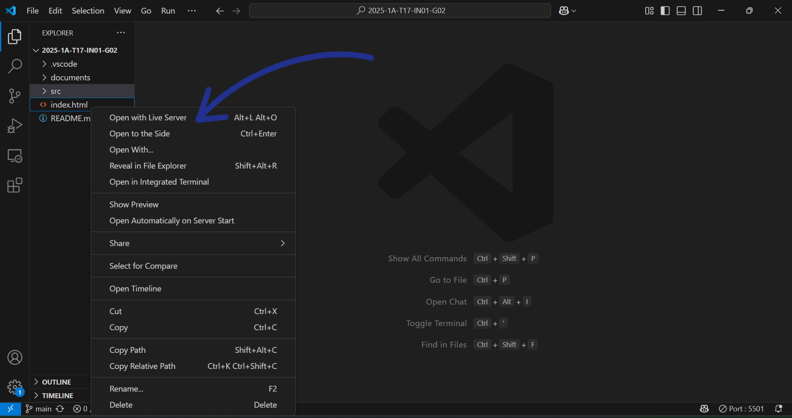

# Inteli - Instituto de Tecnologia e Liderança 

 

# Do Cacau Às Estrelas

## Skill Lab Creative Solutions

## 👨‍🎓 Integrantes: 
- <a href="https://www.linkedin.com/in/annycerazi">Anny Jhulia Cerazi</a>
- <a href="https://www.linkedin.com/in/catarina-sayuri/">Catarina Sayuri Arashiro Braga Felipe</a> 
- <a href="https://www.linkedin.com/in/eduardo-duarte-2a8a55248/">Eduardo Arena Duarte</a> 
- <a href="https://www.linkedin.com/in/jo%C3%A3o-vitor-furtado-de-freitas-4b1974244/">João Vitor Furtado de Freitas</a>
- <a href="https://www.linkedin.com/in/luigi-garotti-2b83b835b/">Luigi Junqueira Garotti</a> 
- <a href="https://www.linkedin.com/in/paulo-henrique0601/">Paulo Henrique Bueno Fernandes</a>

## 👩‍🏫 Professores:
### Coordenador do Curso
- <a href="https://www.linkedin.com/in/sergio-venancio-a509b342/">Sérgio Venâncio</a>
### Professora Orientadora 
- <a href="https://www.linkedin.com/in/fabiana-martins-de-oliveira-8993b0b2/">Fabiana Martins de Oliveira</a>
### Professores Instrutores
- <a href="https://www.linkedin.com/in/natalia-k-37a62052/">Natalia Kloeckner</a>
- <a href="https://www.linkedin.com/in/anacristinadossantos/">Ana Cristina</a> 
- <a href="https://www.linkedin.com/in/francisco-escobar/">Francisco Escobar</a> 
- <a href="https://www.linkedin.com/in/cristiano-benites-687647a8/">Cristiano Benites</a>
- <a href="https://br.linkedin.com/in/henrique-mohallem-paiva-6854b460">Henrique Paiva</a> 

## 📜 Descrição

Do Cacau às Estrelas: Uma História de Sucesso é um jogo digital, desenvolvido para engajar candidatos ao processo seletivo de estágio da empresa Mars. Com uma abordagem gamificada, tem como objetivo apresentar os valores da empresa de forma dinâmica e educativa, promovendo o autoconhecimento, a responsabilidade e o alinhamento com a cultura organizacional da Mars.
A jornada é guiada pelo personagem principal, Choco, um simpático cachorrinho que representa o segmento de pet care da empresa. O jogador acompanha Choco por três fases, cada uma ambientada em um momento de marco histórico da Mars, com mecânicas e desafios únicos. Ao longo da jornada, pop ups interativos fornecem informações relevantes sobre a trajetória da empresa, reforçando o papel educativo e informativo do jogo.

### Objetivo do Jogo:
Como uma etapa do processo seletivo inovador da Mars, você poderá ser guiado pelo Choco, um cachorrinho curioso que embarca em uma jornada através do tempo. Sua missão é vivenciar os principais momentos da história da empresa Mars, entendendo seus valores e ajudando a construir um futuro de sucesso. Para isso, será necessário superar três fases desafiadoras que simbolizam os princípios fundamentais da Mars: Qualidade, Responsabilidade, Eficiência, Mutualidade e Liberdade. Faça um delicioso chocolate com Choco na cozinha de Frank Mars em 1911, administre possibilidades em uma fábrica de chocolates em 1929 e assuma uma posição de liderança de contratação de times em 2025. 

### Conhecimento, Princípios e Propósito:
Do Cacau às Estrelas: Uma História de Sucesso é uma jornada de aprendizado e autoconhecimento. O jogo permite que o jogador conheça os princípios norteadores da Mars, além de como esses valores impactam a cultura da empresa e cada processo interno, desde a produção de um chocolate até a contratação de equipes equilibradas e diversas. 

### Jogo Corporativo:
Desenvolvido com foco no processo seletivo de estágio da Mars, o jogo oferece uma forma moderna e divertida de transmitir a cultura da empresa. Combinando storytelling, gamificação e tomada de decisão, o projeto busca desmistificar o processo seletivo, tornando-o mais leve e conectado com os desafios do mundo corporativo.

### Inclusão e Representatividade:
Com o compromisso com a representatividade e pluralidade, o jogo apresenta uma diversidade realista de personagens. Os personagens refletem a pluralidade da sociedade brasileira, promovendo uma experiência acolhedora para todos os jogadores.

### Acesse nosso jogo clicando [aqui](https://inteli-college.github.io/2025-1A-T17-IN01-G02/)!

## 📁 Estrutura de pastas

Dentre os arquivos e pastas presentes na raiz do projeto, definem-se:

- <b>document</b>: aqui estão todos os documentos do projeto, como o Game Development Document (GDD) bem como documentos complementares, na pasta "other".

- <b>src</b>: Todo o código fonte criado para o desenvolvimento do projeto do jogo.

    - <b>assets</b>: aqui estão os arquivos relacionados a elementos não-estruturados deste repositório, como imagens.

- <b>README.md</b>: arquivo que serve como guia e explicação geral sobre o projeto e o jogo (o mesmo que você está lendo agora).

## 🔧 Como executar o código

### Pré-requisitos

Para executar o código em uma máquina local, são necessários uma série de softwares e arquivos. Estes são os seguintes:

**GitHub e GitHub Desktop**

GitHub é uma plataforma online que permite armazenamento, compartilhamento e colaboração em projetos de programação, utilizando o sistema Git que permite a manutenção de um histórico de versões e um trabalho em equipe organizado.

GitHub Desktop é um aplicativo que facilita o uso do Git e do GitHub no computador, sem usar comandos no terminal.

**Visual Studio Code**

Visual Studio Code, ou VS Code, é um editor de código-fonte, que pode ser expandido com extensões.

**Live server**

Live Server é uma extensão do VS Code que cria um servidor local para visualizar seu site no navegador.

### Passo-a-passo

1. Baixe o GitHub Desktop e VS Code a partir dos seguintes links:

    - [GitHub Desktop](https://desktop.github.com/download/)
    - [VS Code](https://code.visualstudio.com/download )

2. Após a instalação dos programas, instale a extensão do VS Code, o Live Server, dentro do próprio aplicativo.

- Para encontrá-la, entre no Visual Studio Code e acesse o menu de extensões.

	
Figura 1

Fonte: Autoria própria (2025)

- Após isso, busque por "Live Server" e instale a extensão.

	
Figura 2

Fonte: Autoria própria (2025)

3. Clone o repositório com o código para sua máquina.

- Acesse o link por [aqui.](https://github.com/Inteli-College/2025-1A-T17-IN01-G02)

- A partir do botão "code", selecione a opção para abrir com o GitHub Desktop.

	
Figura 3

Fonte: Autoria própria (2025)

- Clone o respositório no local correto dentro de sua máquina.

	
Figura 4

Fonte: Autoria própria (2025)

4. Abra o repositório no VS Code.

	
Figura 5

Fonte: Autoria própria (2025)

- Selecione o arquivo "index.html" com o botão direito do mouse e selecione a opção "abrir com o Live Server".

	
Figura 6

Fonte: Autoria própria (2025)

5. Pronto! Agora é só jogar e se divertir!

## 🗃 Histórico de lançamentos

* 0.2.0 - 11/04/2025
    * Lançamento do MVP
    * Aprimoramento de mecânicas
    * Aprimoramento de experiência do usuário

* 0.1.0 - 28/03/2025
    * Lançamento do primeiro protótipo para testes
    * Criação de mecânicas básicas
    * Criação do design de personagens e mapas

## 📋 Licença/License

<a property="dct:title" rel="cc:attributionURL" href="https://github.com/Intelihub/Template_M1">Skill Lab Creative Slutions</a> by <a rel="cc:attributionURL dct:creator" property="cc:attributionName" href="https://github.com/Intelihub/Template_M1">Inteli, <a href="https://www.linkedin.com/in/annycerazi">Anny Jhulia Cerazi</a>,  <a href="https://www.linkedin.com/in/catarina-sayuri/">Catarina Sayuri Arashiro Braga Felipe</a>, <a href="https://www.linkedin.com/in/eduardo-duarte-2a8a55248/">Eduardo Arena Duarte</a>, <a href="https://www.linkedin.com/in/jo%C3%A3o-vitor-furtado-de-freitas-4b1974244/">João Vitor Furtado de Freitas</a>, <a href="https://www.linkedin.com/in/luigi-garotti-2b83b835b/">Luigi Junqueira Garotti</a>, <a href="https://www.linkedin.com/in/paulo-henrique0601/">Paulo Henrique Bueno Fernandes</a> is licensed under <a href="http://creativecommons.org/licenses/by/4.0/?ref=chooser-v1" target="_blank" rel="license noopener noreferrer" style="display:inline-block;">Attribution 4.0 International</a>.
