# GDD - Game Design Document - Módulo 1 - Inteli

## Skill Lab Creative Solutions

#### Nomes dos integrantes do grupo

- Anny Jhulia Cerazi
- Catarina Sayuri Arashiro Braga Felipe
- Eduardo Arena Duarte
- João Vitor Furtado de Freitas
- Luigi Junqueira Garotti
- Paulo Henrique Bueno Fernandes

## Sumário

[1. Introdução](#c1)

&emsp;[1.1. Plano Estratégico do Projeto](#c2)

&emsp;&emsp;[1.1.1. Contexto da indústria](#c3)

&emsp;&emsp;&emsp;[1.1.1.1. Modelo de 5 Forças de Porter](#c4)

&emsp;&emsp;&emsp;[1.1.2. Análise SWOT](#c5)

&emsp;&emsp;&emsp;[1.1.3. Missão/Visão/Valores](#c6)

&emsp;&emsp;&emsp;[1.1.4. Proposta de Valor](#c7)

&emsp;&emsp;&emsp;[1.1.5. Descrição da solução desenvolvida](#c8)

&emsp;&emsp;&emsp;[1.1.6. Matriz de Riscos](#c9)

&emsp;&emsp;&emsp;[1.1.7. Objetivos, Metas e Indicadores](#c10)

&emsp;[1.2. Requisitos do Projeto](#c11)

&emsp;[1.3. Público-alvo do Projeto](#c12)

[2. Visão Geral do Jogo](#c13)

&emsp;[2.1. Objetivos do Jogo](#c14)

&emsp;[2.2. Características do Jogo](#c15)

&emsp;&emsp;[2.2.1. Gênero do Jogo](#c16)

&emsp;&emsp;[2.2.2. Plataforma do Jogo](#c17)

&emsp;&emsp;[2.2.3. Número de jogadores](#c18)

&emsp;&emsp;[2.2.4. Títulos semelhantes e inspirações](#c19)

&emsp;&emsp;[2.2.5. Tempo estimado de jogo](#c20)

[3. Game Design](#c21)

&emsp;[3.1. Enredo do Jogo](#c22)

&emsp;[3.2. Personagens](#c23)

&emsp;&emsp;[3.2.1. Controláveis](#c24)

&emsp;&emsp;[3.2.2. Diversidade e Representatividade dos Personagens](#c25)

&emsp;[3.3. Mundo do jogo](#c26)

&emsp;&emsp;[3.3.1. Locações Principais e/ou Mapas](#c27)

&emsp;&emsp;[3.3.2. Navegação pelo mundo](#c28)

&emsp;&emsp;[3.3.3. Condições climáticas e temporais](#c29)

&emsp;&emsp;[3.3.4. Concept Art](#c30)

&emsp;&emsp;[3.3.5. Trilha sonora](#c31)

&emsp;[3.4. Gameflow (Diagrama de cenas)](#c32)

&emsp;[3.5. Regras do jogo](#c33)

&emsp;[3.6. Mecânicas do jogo](#c34)

&emsp;[3.7. Implementação Matemática de Animação/Movimento](#c35)

&emsp;&emsp;[3.7.1. Movimento Horizontal (MU)](#c36)

&emsp;&emsp;[3.7.2. Movimento Vertical (MUV)](#c37)

&emsp;&emsp;[3.7.3. Implementação no Código](#c38)

[4. Desenvolvimento do jogo](#c39)

&emsp;[4.1. Desenvolvimento preliminar do jogo](#c40)

&emsp;[4.2. Desenvolvimento básico do jogo](#c41)

&emsp;[4.3. Desenvolvimento intermediário do jogo](#42)

&emsp;[4.4. Desenvolvimento final do MVP](#c43)

&emsp;[4.5. Revisão do MVP](#c44)

[5. Testes](#c45)

&emsp;[5.1. Casos de Teste](#c46)

[5.2. Testes de jogabilidade (playtests)](#c47)

[5.2.1 Registros de testes](#c48)

[5.2.2 Melhorias](#c49)

[6. Conclusões e trabalhos futuros](#c50)

[7. Referências](#c51)

[Anexos](#c52)

## Lista de figuras

Figura 1 - Análise SWOT da Mars, Incorporated

Figura 2 - Value Proposition Canva

Figura 3 - Matriz de riscos

Figura 4 - Tela de instrução

Figura 5 - Mapa principal

Figura 6 - Cozinha, puzzle 1

Figura 7 - Fundo do puzzle 2

Figura 8 - Escritório, puzzle 3

Figura 9 - Personagem principal controlável, cachorrinho Choco

Figura 10 - Personagens NPCs que apoiarão a jornada de Choco durante o jogo

Figura 11 - Conceito do mapa do jogo, mostrando as diferentes “ilhas" que ilustram os níveis

Figura 12 - Visão do interior da casa de Frank Mars

Figura 13 - Cozinha, onde se passa o primeiro puzzle

Figura 14 - A primeira fábrica da Mars, onde se passa o segundo nível

Figura 15 - Escritório da Mars, onde se passa o terceiro nível

Figura 16 - Tela do nível 2

Figura 17 - Tela do nível 2 (escolha 1)

Figura 18 - Tela do nível 2 (escolha 2)

Figura 19 - Diagrama de cenas

Figura 20 - Menu Inicial

Figura 21 - Mapa Principal

Figura 22 - Interior do Quarto

Figura 23 - Encontro com NPC e apresentação da missão

Figura 24 - Tela do mapa atualizada

Figura 25 - Cena do inicio do puzzle na cozinha

Figura 26 - Cena de seleção do cacau

Figura 27 - Cena de seleção da manteiga

Figura 28 - Cena de seleção do açúcar

Figura 29 - Tela do puzzle 2

Figura 30 - Tela do puzzle 3

Figura 31 - Tela do funcionamento do puzzle 3

Figura 32 - Tela com instruções de direção no mapa

Figura 33 - Tela final com créditos

## Lista de tabelas

Tabela 1 - Requisitos do Projeto

Tabela 2 - Trilha sonora

Tabela 3 - Casos de teste

Tabela 4 - Registros de testes

 

# 1. Introdução 

## 1.1. Plano Estratégico do Projeto

### 1.1.1. Contexto da indústria

A Mars, Incorporated é uma das principais multinacionais nos setores de confeitaria, alimentos e petcare. Fundada em 1911, detém marcas icônicas como M&M’s, Snickers, Pedigree, Whiskas e Royal Canin. Com operações em mais de 80 países e receita anual de cerca de US$ 45 bilhões em 2022, está entre os líderes globais desses mercados. No Brasil desde 1978, expandiu sua presença com fábricas em São Paulo e Paraná, investindo R$ 500 milhões em chocolates e R$ 365 milhões no petcare. Focada em segurança alimentar e sustentabilidade, compete com Nestlé, Mondelez, Purina e Hill’s, acompanhando tendências de inovação e saudabilidade.

### 1.1.1.1. Modelo de 5 Forças de Porter 

A Mars está inserida em um mercado altamente competitivo, abrangendo setores de confeitaria, alimentação pet e produtos alimentícios em geral. Para compreender os desafios e oportunidades nesse cenário, a análise das 5 Forças de Porter é essencial. Entre esses fatores, a rivalidade entre concorrentes existentes e o poder de barganha dos clientes são elementos cruciais que influenciam diretamente a estratégia da empresa.

### Ameaça de Novos Entrantes

A Mars opera em mercados altamente competitivos, mas com barreiras significativas para novos entrantes. As principais barreiras incluem:

- Economias de escala: A Mars é uma empresa global com uma enorme capacidade de produção, o que reduz os custos unitários e cria uma vantagem substancial sobre novos concorrentes.
- Lealdade do consumidor: A Mars possui marcas altamente reconhecidas e consolidadas, como M&M’s, Skittles, Snickers e Pedigree, criando uma base de clientes fiel.
- Requisitos de capital: A necessidade de investimentos elevados em produção, marketing e distribuição dificulta a entrada de novos concorrentes.
- Acesso aos canais de distribuição: A Mars tem uma vasta rede de distribuição global que novos entrantes teriam dificuldade em acessar.
- Regulamentações governamentais: A indústria alimentícia e de confeitos é fortemente regulamentada, o que eleva o custo e a complexidade de entrada no mercado.

Impacto Potencial: Apesar dessas barreiras, novos competidores podem surgir com inovações específicas, como produtos mais saudáveis, mas não há uma ameaça significativa para a Mars em termos de perda de participação de mercado.

### Ameaça de Produtos ou Serviços Substitutos

A ameaça de substitutos para a Mars é moderada. Existem substitutos diretos e indiretos que podem afetar a demanda pelos produtos da empresa:

- Substitutos diretos: Concorrentes como Hershey’s, Nestlé e Mondelez oferecem produtos similares.
- Alternativas saudáveis: O movimento de conscientização sobre saúde impulsiona o consumo de snacks mais saudáveis, como barras de proteína.
- Substitutos indiretos: Alimentos frescos, como frutas, representam uma forma indireta de substituição dos produtos da Mars.

Impacto do Nível de Ameaça: A Mars investe constantemente em inovação, desenvolvendo produtos sem açúcar e mais saudáveis, reduzindo o impacto dos substitutos e mantendo sua relevância no mercado.

### Poder de Barganha dos Fornecedores

A Mars lida com um poder de barganha moderado de seus fornecedores. A empresa depende de uma cadeia de suprimentos global que inclui:

- Produtores de matérias-primas: O cacau, açúcar e outros insumos essenciais são mercados globais e possuem poder de barganha relativamente baixo.
- Fornecedores especializados: Insumos específicos podem ter maior poder de barganha devido à limitação de fornecedores.
- Logística: Custos de transporte podem afetar a cadeia de suprimentos.

Impacto do Poder de Barganha: A Mars minimiza riscos através de parcerias estratégicas de longo prazo e iniciativas de sustentabilidade.

### Poder de Barganha dos Clientes

Os clientes da Mars incluem grandes redes varejistas, supermercados, pet shops e consumidores finais. Cada grupo tem um poder de barganha distinto:

- Varejistas e supermercados: Exercem poder significativo sobre os preços, pressionando as margens da Mars.
- Consumidores finais: A demanda por produtos mais saudáveis e sustentáveis torna necessário o investimento em inovação.

Impacto do Poder de Barganha: A Mars equilibra essa pressão devido à força de suas marcas e estratégias de marketing.

### Rivalidade entre Concorrentes Existentes

A rivalidade no setor é intensa, com grandes competidores como Nestlé, Mondelez e Purina. A Mars enfrenta essa rivalidade principalmente em dois segmentos:

- Confeitaria: A Mars aposta em inovação para se diferenciar.
- Alimentação Pet: A humanização dos pets impulsiona a busca por produtos premium e saudáveis.

Impacto da Rivalidade: A Mars se concentra em diferenciação e inovação para manter sua competitividade.

Em conclusão, a Mars está posicionada de forma competitiva forte no mercado, com altas barreiras para novos entrantes e uma forte presença global. A ameaça de substitutos é moderada, mas a empresa lida com isso por meio de inovação e adaptação às preferências dos consumidores. O poder de barganha de fornecedores e clientes, embora significativo, é gerido eficazmente. A rivalidade entre concorrentes exige estratégias de diferenciação e inovação constantes. Dessa forma, a análise das 5 Forças de Porter confirma que a Mars está bem posicionada para continuar sua trajetória de liderança e crescimento sustentável.

### 1.1.2. Análise SWOT 

A Análise SWOT (Figura 1) é uma ferramenta de planejamento estratégico que permite às empresas identificar suas forças, fraquezas, oportunidades e ameaças em relação ao mercado. Ela visa compreender os aspectos internos, que são controláveis pela organização, e os fatores externos, que estão além do seu controle, mas que podem influenciar o negócio (Hofrichter, 2017)

	
Figura 1 - Análise SWOT da Mars, Incorporated

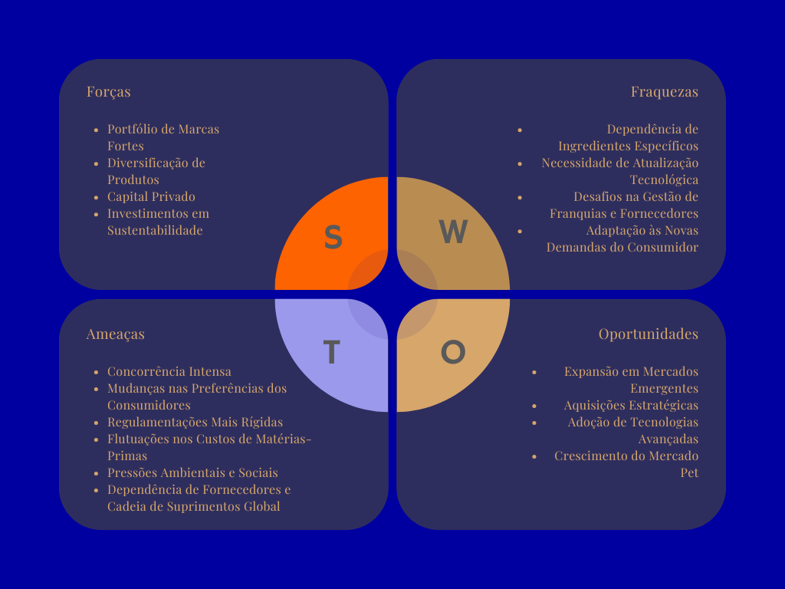

Fonte: Autoria própria (2025)

 

A Mars, Incorporated se destaca por seu portfólio de marcas fortes, diversificação de produtos, capital privado e investimentos em sustentabilidade (Forças). No entanto, enfrenta desafios como dependência de ingredientes específicos, necessidade de atualização tecnológica e dificuldades na gestão de franquias e fornecedores (Fraquezas). As oportunidades incluem expansão em mercados emergentes, aquisições estratégicas, adoção de tecnologias avançadas e crescimento no mercado pet. Entretanto, a empresa lida com concorrência intensa, mudanças nas preferências dos consumidores, regulamentações mais rígidas, flutuações nos custos de matérias-primas e pressões ambientais e sociais (Ameaças). O equilíbrio desses fatores é essencial para sua liderança global.

### 1.1.3. Missão / Visão / Valores 

A Mars Incorporated é uma das maiores e mais influentes empresas de bens de consumo do mundo, atuando em segmentos estratégicos como alimentos para pets, confeitaria e serviços globais. Fundada há mais de um século, a empresa consolidou sua posição de liderança por meio de inovação contínua, compromisso com a qualidade e forte responsabilidade social e ambiental. Com operações em diversos países e uma ampla gama de produtos e serviços, a Mars busca não apenas atender às necessidades do mercado, mas também promover impactos positivos para consumidores, comunidades e para o planeta.
O sucesso da Mars é sustentado por seus princípios fundamentais, que orientam sua cultura organizacional e estratégias empresariais. Seu compromisso com a sustentabilidade, inovação e bem-estar reflete-se em cada segmento de atuação. A seguir, exploramos a Missão, Visão e Valores (MVV) da Mars como um todo e de seus principais segmentos: Petcare, Snacking e Global Services.

### Missão, Visão e Valores da Mars

**Missão**

A missão da Mars é criar um mundo melhor, com impactos positivos nas pessoas, animais e no planeta, por meio de práticas responsáveis e inovadoras. A empresa investe em sustentabilidade, desenvolvimento social e inovação para garantir um legado positivo.

**Visão**

A visão da Mars é ser uma referência global em responsabilidade e inovação, criando um futuro mais sustentável, saudável e justo por meio de pesquisa, digitalização e aprimoramento contínuo de suas estratégias.

**Valores**

Os valores da Mars incluem Qualidade, Responsabilidade, Reciprocidade, Eficiência e Liberdade, guiando suas decisões e práticas para promover excelência, sustentabilidade, colaboração, otimização e inovação.

###  Missão, Visão e Valores do segmento de Petcare

**Missão**

Transformar o mundo em um lugar melhor para os animais de estimação e seus tutores, promovendo saúde, bem-estar e nutrição animal por meio de pesquisas e tecnologias inovadoras.

**Visão**

Ser líder global em cuidados com animais de estimação, oferecendo soluções acessíveis e inovadoras para melhorar a vida dos pets e de seus tutores, com foco em nutrição e assistência veterinária.

**Valores**

Promover o bem-estar animal com produtos e serviços de qualidade, investindo em inovação, sustentabilidade e parceria com os tutores para oferecer o melhor cuidado possível aos pets.

###  Missão, Visão e Valores do segmento de Snacking

**Missão**

Proporcionar momentos de alegria e prazer aos consumidores com produtos saborosos e de alta qualidade, combinando indulgência e bem-estar.
A Mars se preocupa com a responsabilidade nutricional, oferecendo opções equilibradas e inovadoras.

**Visão**

Ser a principal referência global no setor de snacks, expandindo seu portfólio para atender a todas as preferências e necessidades dos consumidores. A Mars Snacking busca inovar constantemente, trazendo novas experiências gastronômicas e equilibrando prazer e saúde em suas formulações.

**Valores**

Garantir produtos com altos padrões de qualidade e sabor, selecionando os melhores ingredientes.
Promover responsabilidade nutricional, sustentabilidade e inovação em todas as etapas de produção.

###  Missão, Visão e Valores do segmento de Global Services

**Missão**

A missão da Mars Global Services é fornecer suporte estratégico e operacional para as unidades de negócio da empresa, garantindo eficiência, inovação e excelência nos processos internos. O objetivo é criar soluções ágeis e sustentáveis que impulsionem o crescimento da Mars em escala global, assegurando que todas as operações estejam alinhadas com os valores e compromissos da empresa.

**Visão**

Ser referência em serviços corporativos dentro da Mars, utilizando tecnologia e inovação para transformar a maneira como a empresa gerencia seus negócios. A Global Services busca constantemente otimizar processos internos e criar modelos operacionais mais eficientes e sustentáveis.

**Valores**

A Mars Global Services prioriza a excelência operacional, buscando aumentar a eficiência e competitividade. A inovação tecnológica é um pilar central, com investimentos em digitalização e automação. A sustentabilidade corporativa é essencial, garantindo um crescimento ético e responsável. A colaboração é valorizada para promover inovação e integração entre setores.

A Mars Incorporated se destaca como uma empresa global que vai além da simples comercialização de bens de consumo. Sua atuação estratégica nos segmentos de Petcare, Snacking e Global Services reflete um compromisso profundo com a qualidade, a inovação e a sustentabilidade. A empresa não apenas responde às necessidades do mercado, mas antecipa tendências e busca constantemente gerar impactos positivos na sociedade e no meio ambiente. Dessa forma, sua missão, visão e valores não são apenas diretrizes institucionais, mas princípios fundamentais que moldam sua identidade e impulsionam seu sucesso contínuo.

### 1.1.4. Proposta de Valor 
  O Canvas de Proposta de Valor é uma ferramenta visual que auxilia as empresas a entenderem de maneira mais clara as necessidades, desejos e desafios de seus clientes. Ele também serve para criar propostas de valor que atendam de forma mais precisa e eficiente a essas demandas, melhorando a oferta de produtos ou serviços (Osterwalder, 2015).

	
Figura 2 - Value Proposition Canva

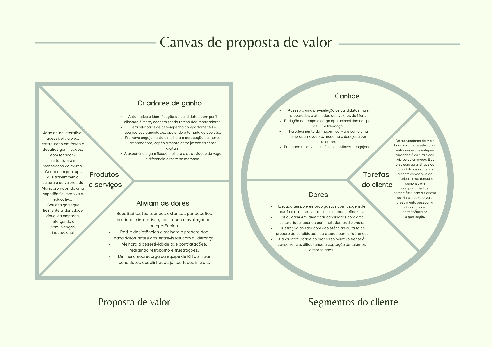

Fonte: Autoria própria (2025)

 

##### Segmentos do Cliente (lado direito)
- Tarefas do Cliente:

- Busca contratar estagiários com perfil alinhado à empresa.

- Valoriza o crescimento dos colaboradores e a retenção de talentos.

###### Dores:

- Candidatos despreparados ou desistências na etapa de entrevistas.

- Exige esforço extra da equipe de recrutamento, que já tem outras responsabilidades.

###### Ganhos:

- Melhoria na qualidade dos candidatos avaliados.

- Redução do tempo e esforço para avaliação.

##### Proposta de Valor (lado esquerdo)
###### Produtos e Serviços:

- Plataforma web interativa e gamificada baseada nos valores da Mars.

- Avaliação estruturada com progressão por fases e NPCs que fornecem informações da empresa.

- Design alinhado à identidade visual da Mars para reforçar a comunicação institucional.

###### Criadores de Ganho:

- Processo seletivo mais eficiente e engajador.

- Redução do tempo e esforço dos recrutadores.

- Fortalecimento da identidade da marca e aprimoramento da triagem dos participantes.

###### Aliviadores de Dores:

- Redução de candidatos despreparados e minimização de desistências.

- Avaliação objetiva e eliminação de testes teóricos extensos.

- Melhoria na experiência do candidato e fortalecimento da imagem da Mars como empresa inovadora.

### 1.1.5 Descrição da Solução Desenvolvida 

A solução desenvolvida é um jogo interativo e gamificado para auxiliar candidatos a estágio na Mars a compreender e assimilar seus valores corporativos de forma dinâmica. Com três fases, cada uma focada em pilares essenciais para a  empresa, que são  Qualidade, Responsabilidade e Eficiência, e Mutualidade e Liberdade, o jogo oferece aprendizado prático por meio de desafios ambientados na história da Mars.
  O objetivo é tornar o processo seletivo mais acessível, promovendo o autoconhecimento e a responsabilidade dos candidatos. Recursos como elementos educativos, Pop-ups informativos e um mapa cronológico enriquecem a experiência. Na fase final, o jogador assume o papel de avaliador de candidatos, conectando-se diretamente ao contexto real da seleção.
  Essa abordagem inovadora gera valor ao engajar e preparar futuros colaboradores de maneira envolvente e eficaz, alinhando-se às expectativas do parceiro de negócios.

### 1.1.6 Matriz de Riscos

A Matriz de Riscos é uma ferramenta que possibilita a análise de riscos de acordo com dois fatores: probabilidade e impacto. A probabilidade avalia o quanto é provável que um risco aconteça, comumente relacionada a frequência desse determinado risco. O impacto está relacionado a quanto aquilo afetará o projeto e a empresa caso o risco se torne realidade.
A partir disso, prioriza-se planos de mitigação e contingência, para que os riscos não se tornem um problema durante o projeto analisado.

	
Figura 3 - Matriz de riscos

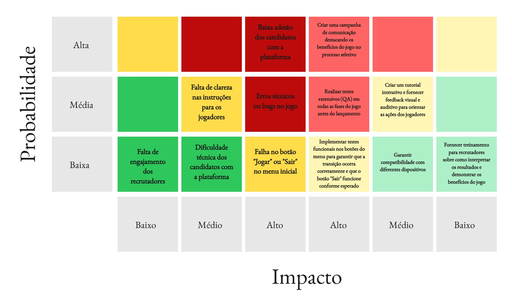

Fonte: Autoria própria (2025)

 

#### Sobre os riscos analisados na matriz:

Falta de engajamento dos recrutadores: possui uma probabilidade baixa e baixo impacto por consequência, já que é necessário engajamento por parte do candidato para sucesso do jogo. Como oportunidade, acontece a possibilidade da criação de um treinamento para recrutadores sobre como interpretar os resultados e demonstrar os benefícios do jogo.

Dificuldade técnica dos candidatos com a plataforma: possui uma probabilidade baixa e médio impacto por ser um jogo simples, que não exige de grandes habilidade técnicas, porém sendo algo que afeta a jogabilidade. Como oportunidade, cria-se a possibilidade de garantir compatibilidade com diferentes dispositivos, evoluindo a solução.

Falha no botão "Jogar" ou "Sair" no menu inicial: possui uma probabilidade baixa e alto impacto,  Implementar testes funcionais nos botões do menu para garantir que a transição ocorra corretamente e que o botão "Sair" funcione conforme esperado

Falta de clareza nas instruções para os jogadores: possui uma probabilidade média, com impacto médio, já que a criação de uma experiência de UX interativa e produtiva pode sofrer falhas no meio do processo, impactando a jogabilidade mas não ao ppnto de tornar o jogo impossível. Como oportunidade, é possível a ciação de um tutorial interativo, além do fornecimento de feedback visual e auditivo para orientar as ações dos jogadores, estimulando-os.

Erros técnicos ou bugs no jogo: possui uma probabilidade média, com impacto alto, pois bugs são comuns no primeiro momento de aplicação de um jogo, mas podem impedir a realização do objetivo e finalização do mesmo. Como oportunidade, existe a realização de testes extensivos antes do lançamento, permitindo aprimoramento e refinamento.

Baixa adesão dos candidatos com a plataforma: possui uma probabilidade alta, com impacto alto, já que o perfil do candidato pode não se adequar ao modelo do jogo como esperado, criando um afastamento e inconclusão da etapa no processo seletivo. Como oportunidade, criar uma campanha de comunicação destacando os benefícios do jogo no processo seletivo, além de adequar os temas e movimentos ao público alvo.
Com base na matriz de probabilidade e impacto, o risco de baixa adesão dos candidatos com a plataforma, por ter alta probabilidade e alto impacto, exige atenção especial. Além da campanha de comunicação e adequações temáticas, é importante aplicar testes com grupos focais, identificar barreiras de engajamento e adaptar a experiência. A inclusão de elementos personalizados e recompensas por progresso também pode incentivar a continuidade. Essas ações tornam a solução mais atrativa e aumentam as chances de participação efetiva dos candidatos.

### 1.1.7 Objetivos, Metas e Indicadores

### Objetivos do Jogo 
####  Gamificar o Processo Seletivo

- Específico: Transformar o processo seletivo da Mars em uma experiência interativa, intuitiva e imersiva.

- Mensurável: Aumento de 20% no engajamento dos candidatos durante o processo seletivo, com base em métricas de tempo de jogo e feedback dos jogadores.

- Alcançável: Implementação de uma interface intuitiva e imersiva que facilite a navegação e a interação.

- Relevante: Engajar os candidatos com o objetivo de proporcionar uma experiência única, alinhada aos valores da Mars.

- Temporal: Concluir o desenvolvimento dessa funcionalidade até a versão beta do jogo.

#### Ensinar os Valores da Mars

- Específico: Integrar os valores fundamentais da Mars na jogabilidade, garantindo que os candidatos compreendam e apliquem esses valores nas decisões do jogo.

- Mensurável: 90% dos jogadores devem identificar corretamente os valores da Mars após concluir o jogo, com base em uma pesquisa pós-jogo.

- Alcançável: Desenvolver fases e cenários que desafiem os jogadores a tomar decisões com base nesses valores.

- Relevante: Garantir que os candidatos, ao interagir com o jogo, se alinhem com a cultura e valores da empresa.

- Temporal: Incluir todas as referências aos valores da Mars até a fase de testes iniciais.

####  Promover Engajamento e Autoconhecimento

- Específico: Estimular a reflexão estratégica e a tomada de decisões, refletindo desafios reais do ambiente profissional.

- Mensurável: Atingir uma média de 30 minutos de engajamento por jogador, com uma taxa de retorno de 60% para jogar novamente.

- Alcançável: Implementar desafios de diferentes níveis de dificuldade, garantindo a participação contínua dos jogadores.

- Relevante: Estimular o autoconhecimento dos jogadores, refletindo as habilidades e decisões que serão relevantes no ambiente de trabalho.

- Temporal: Obter as métricas de engajamento e autoconhecimento após os primeiros 3 meses de uso do jogo.

####  Criar uma Experiência Narrativa Significativa

 - Específico: Apresentar a trajetória e história da Mars de forma envolvente, utilizando NPCs, diálogos e um mapa cronológico.

- Mensurável: Obter uma taxa de 80% de compreensão da narrativa da Mars por parte dos jogadores, medida por meio de pesquisa de satisfação ao final do jogo.

- Alcançável: Utilizar narrativas imersivas e interativas que incentivem os jogadores a se engajar com a história.

- Relevante: A narrativa deve conectar os jogadores à história e aos valores da Mars, criando uma experiência memorável.

- Temporal: Implementar e testar a narrativa completa nas primeiras versões do jogo, dentro de 6 meses.

#### Avaliar as Competências dos Candidatos

- Específico: Testar habilidades analíticas, tomada de decisão e compreensão dos valores da empresa de forma prática e lúdica.

- Mensurável: 85% dos jogadores devem ser capazes de identificar suas áreas fortes e fracas em termos de competências após a finalização do jogo, medido através de uma avaliação de desempenho no final.

- Alcançável: Criar um sistema de feedback que forneça insights sobre a performance dos jogadores.

- Relevante: Avaliar as habilidades que são cruciais para o sucesso na Mars.

- Temporal: Incorporar o sistema de feedback até a fase de testes alfa.

## Metas do Jogo 
#### Desenvolvimento Técnico

- Específico: Implementar uma tela inicial com as opções de "Jogar", "Configurações", "Instruções" e "Sair", garantir jogabilidade fluida com controle por teclas WASD e criar um sistema de mapa para acompanhar o progresso do jogador.

- Mensurável: 100% da tela inicial funcional com as opções corretas, controle fluido de teclas e sistema de mapa implementado e testado.

- Alcançável: Desenvolver esses recursos de forma incremental com testes semanais.

- Relevante: Garantir uma interface intuitiva e a fluidez da jogabilidade, essenciais para a experiência do usuário.

- Temporal: Concluir a implementação dessas funcionalidades nas primeiras 4 semanas de desenvolvimento.

####  Experiência do Usuário

- Específico: Garantir que o jogo tenha uma duração média de 30 minutos, mantendo o engajamento dos jogadores, e criar um sistema de NPCs interativos.

- Mensurável: Monitorar a duração média das sessões de jogo e garantir que 80% dos jogadores completam o jogo em 30 minutos.

- Alcançável: Ajustar a dificuldade do jogo e desenvolver NPCs interativos que sejam dinâmicos.

- Relevante: Manter o jogador engajado enquanto proporciona uma experiência educativa e divertida.

- Temporal: Medir a experiência do usuário após o lançamento da versão beta e ajustar conforme necessário.

#### Mecânica de Avaliação

- Específico: Criar desafios em três fases, cada uma abordando um valor da Mars, e implementar um sistema de tomada de decisão na terceira fase.

- Mensurável: 90% dos jogadores devem completar as três fases e tomar decisões baseadas nos valores da Mars.

- Alcançável: Incluir opções estratégicas de escolha que desafiem o jogador.

- Relevante: Garantir que as decisões no jogo reflitam competências chave para a Mars.

- Temporal: Finalizar a mecânica de avaliação até o final da fase de testes alfa.

## Indicadores de Sucesso 
#### Progresso do Jogador

- Mensurável: Acompanhar o progresso com uma barra de progresso clara e feedback visual.

- Alcançável: Implementar um sistema de salvamento automático para permitir que o jogador acompanhe seu progresso.

- Relevante: Fundamental para medir o engajamento do jogador e a clareza no avanço da história.

- Temporal: Finalizar essa funcionalidade na primeira versão do jogo.

#### Pontuação e Desempenho

- Mensurável: Definir um sistema de pontuação que atribua valores com base nas escolhas e no tempo de conclusão.

- Alcançável: Atribuir uma pontuação com base em parâmetros específicos como tempo, precisão e escolhas feitas.

- Relevante: Isso ajuda a avaliar como as decisões do jogador impactam o desempenho no jogo.

- Temporal: Implementar e testar o sistema de pontuação até a fase beta.

## 1.2 Requisitos do Projeto 
Os requisitos de um projeto são as condições ou características que devem ser atendidas para que ele seja considerado bem-sucedido. Eles descrevem as expectativas e 
necessidades das partes interessadas, como clientes, usuários e membros da equipe, sendo essenciais para orientar o desenvolvimento e a execução do projeto. Com base nos 
feedbacks dos parceiros da Mars, alguns requisitos já foram definidos.

Tabela 1 - Requisitos do Projeto

\# | Requisito  
--- | ---
1 | O jogo contará com uma tela inicial contendo opções de instruções, configurações e as opções "Jogar" e "Sair".
2 | O controle do personagem é feito por meio das teclas WASD.
3 | O jogo está sendo desenvolvido sob solicitação do parceiro, com foco na plataforma web.
4 | O jogo terá um mapa para acompanhar os avanços do personagem, em ordem cronológica da história Mars.
5 | Tornar o processo seletivo mais acessível e intuitivo, promovendo um senso de responsabilidade e autoconhecimento
6 | O jogador poderá interagir com NPCs que irão revelar a história da marca por meio de diálogos e instruções, proporcionando uma experiência imersiva e envolvente.
7 | Jogo de curta duração (em média 30 minutos).
8 | O jogo funciona com foco no uso web.
9 | Nos 3 níveis se testa os conhecimentos sobre os valores Mars.
10 | O jogo disponibiliza logos e referências visuais baseados na Mars.
11 | As instruções do jogo são claras, permitindo uma progressão natural para o jogador ao longo dos três níveis.

Fonte: Autoria Própria (2025) 

## 1.3 Público-alvo do Projeto

O jogo "Do Cacau às Estrelas" foi desenvolvido para engajar e avaliar candidatos do processo seletivo de estágio da MARS. O público-alvo deste projeto consiste em jovens adultos, geralmente entre 17 e 25 anos, com possíveis candidatos um pouco mais velhos. Este perfil demográfico corresponde a estudantes universitários e recém-formados que buscam ingressar no mercado de trabalho e iniciar suas carreiras em uma empresa global como a MARS.

Para compreender melhor esse público, foi realizada uma análise baseada em tendências de consumo de mídia e hábitos de entretenimento. Foi identificado que essa faixa etária consome fortemente mídias digitais, incluindo redes sociais, plataformas de streaming e, principalmente, jogos eletrônicos. O consumo de jogos não se limita apenas a um passatempo, mas também representa uma forma de socialização, aprendizado e desafio intelectual para esse público.

Em relação às preferências no universo dos jogos, os candidatos ao estágio da MARS demonstram grande interesse por três categorias principais de jogos:
- **Jogos competitivos**: Títulos como *Valorant* e *Fortnite* são altamente populares entre esse público, indicando um gosto por desafios, reflexos rápidos e partidas dinâmicas.
- **Jogos estratégicos**: Jogos como *League of Legends (LoL)* e *Dota 2* mostram que esse público aprecia mecânicas complexas, planejamento tático e trabalho em equipe.
- **Jogos independentes (indies)**: Títulos como *Hades*, *Hollow Knight* e *Celeste* revelam um apreço por narrativas envolventes, desafios de precisão e experiências diferenciadas do mercado tradicional de games.

Além das preferências de jogos, observa-se que esse público valoriza experiências imersivas e interativas, bem como conteúdos que desafiem suas habilidades e promovam crescimento pessoal e profissional. Sendo assim, "Do Cacau às Estrelas" foi desenvolvido considerando esses fatores, combinando elementos estratégicos, narrativos e de tomada de decisão, de forma a criar um jogo que não só entretenha, mas também avalie as habilidades analíticas e de resolução de problemas dos candidatos.

Dessa forma, o jogo não apenas proporciona uma experiência engajante para os participantes do processo seletivo, mas também reflete as competências e características esperadas dos futuros estagiários da MARS, garantindo uma seleção mais alinhada ao perfil buscado pela empresa.

# 2. Visão Geral do Jogo 
Esta seção apresenta um panorama geral do jogo, abordando seus objetivos, mecânicas principais e características fundamentais. O propósito é alinhar a equipe de desenvolvimento e os stakeholders em relação à visão global do projeto, garantindo que as decisões criativas e estratégicas sejam coerentes com a proposta do jogo.

## 2.1. Objetivos do Jogo
O jogo foi desenvolvido para proporcionar uma experiência interativa e gamificada que permita aos candidatos a estágio da empresa Mars compreender e assimilar os valores Mars de forma dinâmica e motivadora. O jogador deve passar por diferentes desafios ao longo das três fases, desenvolvendo competências essenciais buscadas pela empresa.
Além disso, o jogo apresenta uma linha cronológica da história da Mars, reforçando o aprendizado sobre a empresa e seu crescimento ao longo do tempo. Essa abordagem está alinhada ao requisito de que o jogo inclua um mapa para acompanhar os avanços do personagem em ordem cronológica.

### Desenvolvimento do Jogo

Cada fase do jogo explora os valores fundamentais da Mars e busca desconstruir a ideia de um processo seletivo complicado, promovendo um senso de responsabilidade e autoconhecimento. Além disso, a mecânica da terceira fase, onde o jogador avalia candidatos para contratação, reforça a conexão com os objetivos do jogo e com o processo seletivo da empresa.
O jogo também inclui pop-ups que fornecem informações sobre a história da Mars por meio de instruções, cumprindo o requisito de que os pop-ups tenham um papel educativo na narrativa.

### Objetivo

O objetivo principal do jogo é retratar a trajetória da empresa Mars por meio de cenários inspirados em momentos-chave de sua história. A experiência busca não apenas transmitir conhecimento sobre a empresa, mas também promover autoconhecimento e confiança nos candidatos do processo seletivo de estágio.

Para concluir o jogo, os jogadores devem superar três fases, cada uma explorando um dos valores fundamentais da Mars.

#### **Fase 1 - Qualidade**  
- Ambientada na cozinha da casa de **Frank Mars**.  
- O jogador deve acertar as medidas corretas necessárias para preparar um chocolate de qualidade, destacando o princípio da qualidade que a empresa valoriza.

#### **Fase 2 - Responsabilidade e Eficiência**  
- Baseada na **fábrica de chocolate de Chicago**.  
- O jogador precisa administrar as variáveis da empresa, fazendo escolhas sábias, através de cartas. Cada escolha, reflete resultados no lucros, público, funcionários e pilares.

#### **Fase 3 - Mutualidade e Liberdade**  
- Inspirada nos **atuais escritórios da empresa Mars** 
- O objetivo é **avaliar bons candidatos para o processo de contratação** da empresa. Valorizando as soft-skills e hard-skills dos candidatos, todas as suas escolhas devem formar uma equipe balanceada.  

## 2.2. Características do Jogo
Aqui são apresentadas as principais características que definem a experiência do jogo, abordando seu gênero, plataforma, número de jogadores e inspirações.

### 2.2.1. Gênero do Jogo

O jogo pertence ao gênero aventura, com elementos de Escape Room e serious game. Sua proposta é baseada na resolução de desafios interativos ambientados em cenários temáticos que retratam momentos históricos da empresa Mars. O jogador deve explorar esses ambientes, ler os pop-ups com conteúdos educativos e resolver problemas lógicos para avançar na narrativa.

Inspirado em jogos como Stardew Valley, o projeto valoriza a liberdade de exploração e a construção de uma experiência imersiva. Assim como no título citado, o jogador pode se movimentar livremente pelos cenários utilizando as teclas WASD, interagir com diferentes elementos do ambiente e se envolver de forma ativa com a história, tornando a jornada mais dinâmica e envolvente.

### 2.2.2. Plataforma do Jogo
Do Cacau Às Estrelas: Uma História de Sucesso é um jogo para navegadores, compatível com Windows, macOS e Linux, projetado para ser acessado diretamente por meio de navegadores modernos, como Google Chrome, Mozilla Firefox e Microsoft Edge. O jogo foi otimizado para rodar exclusivamente em desktops e notebooks, garantindo melhor desempenho e experiência em telas maiores.
O jogo também inclui uma tela inicial com opções de configurações, e uma tela inicial de instruções, permitindo que os jogadores ajustem preferências e compreendam melhor as mecânicas antes de iniciar a experiência.

### 2.2.3. Número de jogadores
Do Cacau Às Estrelas: Uma História de Sucesso é um jogo single player, proporcionando uma experiência individual focada na jornada de aprendizado e desafios interativos.

### 2.2.4. Títulos semelhantes e inspirações
Para o desenvolvimento do jogo, foram analisados títulos com mecânicas, estilos e propostas semelhantes, servindo como referência para a experiência desejada. Entre as principais inspirações estão:
- [Stardew Valley](https://www.stardewvalley.net/)
- [Overcooked](https://www.team17.com/games/overcooked)
- [Purble Place](https://store.steampowered.com/app/1117090/Purple_Place__Classic_Games/)
- [Papers, Please](https://store.steampowered.com/app/239030/Papers_Please/)
- [Reigns](https://www.reignsgame.com/reigns)

### 2.2.5. Tempo estimado de jogo
O jogo foi projetado para ter uma duração máxima de 30 minutos, alinhado com a proposta de ser uma experiência curta e envolvente. Cada partida pode durar cerca de 15 minutos, dependendo do ritmo do jogador ao completar os desafios.
Com essas características, o jogo busca proporcionar uma experiência dinâmica, educativa e alinhada aos valores da empresa Mars.

# 3. Game Design 
Game Design é o processo de idealização, planejamento e estruturação de todos os elementos que compõem um jogo, incluindo suas mecânicas, regras, objetivos, a experiência do jogador, o que o torna divertido e quais emoções ele deve provocar.

## 3.1. Enredo do Jogo 

### Primeira fase: Casa do Frank Mars

Choco percorre o mapa e encontra a casa de Frank Mars, ambientada em 1911. Ao se aproximar, um pop-up surge com orientações, como se o próprio Frank Mars estivesse pedindo ajuda para criar um chocolate perfeito, garantindo alta qualidade.

Para isso, uma barra de comando com movimento automático será exibida, e o jogador deverá acertar a medida correta, representada pela cor verde. Caso erre, o chocolate poderá ficar muito amargo ou muito doce, impactando sua qualidade, e o jogador terá que tentar novamente.

Mecânicas:

 - O jogador deve monitorar uma barra de quantidade, que indica se o valor está correto ou não.

 - A barra possui marcações em vermelho e verde: quando o indicador está na área verde, a quantidade está correta; se estiver na vermelha, significa um erro na dosagem.
  
### Segunda fase: fábrica de produtos Mars.

O jogo se passa em uma fábrica de chocolates em 1929, no início da trajetória da marca Mars. O jogador assume o papel de administrador da fábrica e precisa gerenciar a produção enquanto absorve de forma interativa os valores da marca. A mecânica é baseada em um deck de cartas no estilo Reigns, com uma imagem central e um texto descritivo na parte inferior.

O jogador deve equilibrar quatro parâmetros:

1. **Público** – Representa a opinião do público-alvo.
2. **Lucro** – Mede a lucratividade da empresa.
3. **Princípios Mars** – Indica o quão alinhada a administração está com os valores da marca (principalmente responsabilidade e eficiência).
4. **Funcionários** – Mede o contentamento e o bem-estar dos funcionários.

Caso algum parâmetro atinja o máximo ou o mínimo, o jogador perde. O objetivo principal é equilibrar todos os parâmetros, focando em **responsabilidade e eficiência**, que são dois dos principais pilares da marca Mars.

Mecânicas:

- O jogador responde aos desafios arrastando a carta para a **direita** ou para a **esquerda**, representando duas escolhas possíveis.
- Cada escolha afeta um ou mais parâmetros, aumentando ou diminuindo seus valores.
- Eventos inesperados surgem aleatoriamente, testando a capacidade do jogador de tomar decisões responsáveis e eficientes.

### Terceira fase: escritório da empresa. Mutualidade e Liberdade

Choco chega à empresa no futuro, em 2025, e logo é reconhecido por seu excelente trabalho passado na fábrica. Esse reconhecimento o coloca temporariamente em uma posição de destaque: a de gerente, responsável pela contratação de uma nova equipe para cada setor da empresa. O antigo gerente enfrentou problemas pessoais, e você foi escolhido para assumir seu papel por um dia.

O puzzle/minigame seguiria as mecânicas estabelecidas e, ao final, você receberá uma avaliação indicando se foi aprovado ou não. Caso seja aprovado, você adquire os princípios de mutualidade e liberdade, ficando finalmente pronto para a entrevista.

Mecânicas:

- Um novo projeto é lançado em cada setor da Mars — Global Services, Snacking e Petcare. O jogador tem liberdade para escolher quais funcionários farão parte da equipe responsável por cada iniciativa.
- Diferentes tipos de projetos e problemas exigem equipes com qualidades específicas.
Cada contexto demanda habilidades, perfis e dinâmicas distintas para que a equipe atue de forma eficaz e atinja os objetivos com excelência.
- O jogador pode montar sua equipe escolhendo entre perfis de funcionários com Hard Skills e Soft Skills, buscando equilibrar competências técnicas e interpessoais. Essa escolha influencia diretamente na resolução dos desafios e no avanço da narrativa, reforçando a importância da colaboração e da diversidade de habilidades em um ambiente corporativo.

## 3.2. Personagens 

Nesta sessão, você encontrará informações sobre o personagem do jogo, incluindo suas funcionalidades, habilidades e papel dentro da gameplay.

### 3.2.1. Controláveis

A personagem principal é o Choco, cachorrinho marrom que vai seguir pelas fases controlado pelo usuário. O objetivo dele é ajudar o Frank Mars a viver sua história, conhecendo  seus valores, dificuldades enfrentadas  e o contexto da empresa no geral.

Como homenagem ao segmento de pet care, o personagem é amigável e interaje com os pop-ups permitindo uma interação que é a base da jogabilidade. Ele será o representativo do aprendizado do player, demonstrando suas habilidades e onde ainda é necessário atenção e melhorias.

### 3.2.2. Diversidade e Representatividade dos Personagens

  Nossa equipe está profundamente comprometida em tornar Do Cacau às Estrelas uma experiência inclusiva para todos os jogadores. Com esse objetivo, realizamos pesquisas que nos ajudaram a definir o elenco ideal para o nosso jogo.
 De acordo com o Censo de 2022, aproximadamente 52% da população brasileira se identifica como preta ou parda, e 51,2% é composta por mulheres. Além disso, um estudo do G1 revelou que 9 em cada 10 brasileiros já tiveram um animal de estimação na família. Esses dados, somados à recente expansão da MARS no setor de pet care, foram fundamentais para orientar o desenvolvimento de nossos personagens.
  O protagonista jogável será o Choco, um cachorrinho que acompanhará o jogador ao longo de todas as fases de forma neutra. Já os NPCs (personagens não jogáveis) serão criados de maneira representativa, com diferentes etnias e gêneros, para refletir a diversidade da população brasileira.

## 3.3. Mundo do jogo 
Esta sessão apresenta o universo onde o jogo se passa, com foco nas principais locações, mapas e estrutura de navegação entre os níveis. Aqui são descritos os cenários que compõem a jornada do jogador, seus elementos visuais e históricos, bem como a forma como o personagem interage com esses ambientes. Também inclui detalhes sobre a ambientação temporal e aspectos estéticos que enriquecem a experiência imersiva do jogo.

### 3.3.1. Locações Principais e/ou Mapas 

	
Figura 4 - Tela de instrução

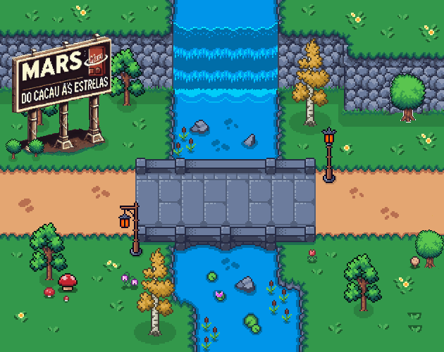

Fonte: Kenmi Pixel Art, alterações feitas (2025)

 

- O jogador poderá se movimentar pela tela de instruções, onde um pop-up surgirá exibindo os comandos do jogo e explicando sua mecânica de movimentação. Esse guia fornecerá detalhes sobre a jogabilidade e o que esperar ao longo da experiência.

	
Figura 5 - Mapa principal

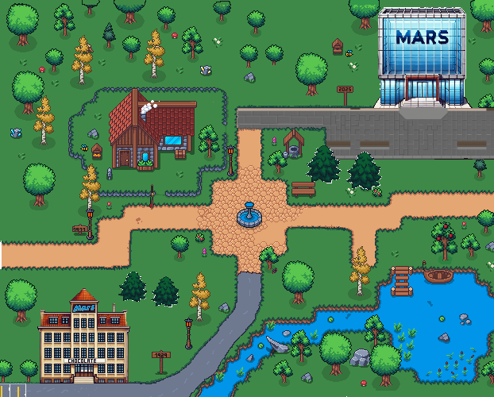

Fonte: Kenmi Pixel Art, alterações feitas (2025)

 

- Este é o mapa principal do jogo, representando a jornada do jogador por três fases distintas, cada uma ambientada em um período histórico marcante. A primeira fase acontece em uma casa com a placa "1911", simbolizando o ano do primeiro grande acontecimento do jogo e dando início à narrativa. No canto inferior esquerdo, encontra-se a imponente fábrica de Chicago em 1929, onde o jogador enfrentará desafios estratégicos no segundo puzzle, imerso no contexto da época. Por fim, no canto superior direito, destaca-se um dos prédios modernos da empresa Mars, cenário do terceiro puzzle, onde passado e presente se conectam para concluir a trajetória do jogo.

	
Figura 6 - Cozinha, puzzle 1

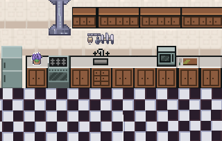

Fonte: Autoria própria (2025)

 

- A Cozinha do Frank Mars é o cenário onde acontece o primeiro puzzle do jogo. Esse ambiente representa o local onde Frank Mars começou a desenvolver suas receitas de chocolates, um espaço que mistura o rústico com o inovador.
Estilo: Uma cozinha dos anos 1929, com uma mistura de madeira, e chão quadriculado.

	
Figura 7 - Fundo do puzzle 2

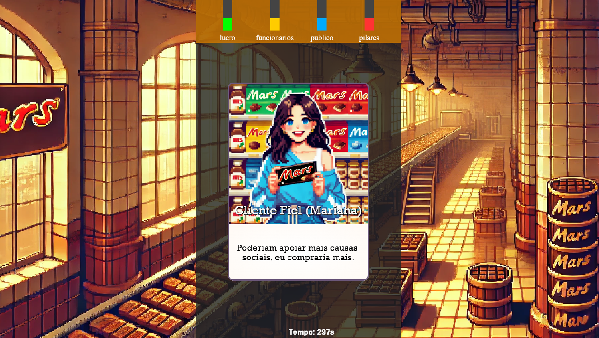

Fonte: Autoria própria com uso de IA (2025)

 

- O Fundo do Segundo Puzzle representa a fábrica da Mars em seu estágio inicial, criando um contraste entre a tradição e a modernidade. Enquanto o jogador interage com NPCs ilustrativos nas e escolhe cartas para tomar decisões estratégicas, o ambiente ao fundo reforça a importância da produção e do processo industrial na jornada da marca.

	
Figura 8 - Escritório, puzzle 3

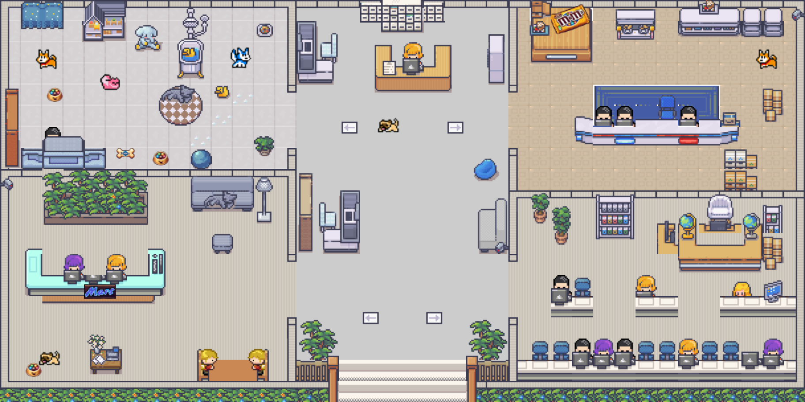

Fonte: Autoria própria com uso de tilesets (2025)

 

- A Cena do Escritório é o cenário onde o terceiro puzzle do jogo acontece e é fundamental para representar a grandiosidade da Mars como uma corporação global. O espaço é vasto, moderno e multifacetado, refletindo a diversidade de áreas de atuação da empresa, como Global Services, Petcare, e Snacking. Contendo diversidade, pets pela empresa e elementos coloridos referentes a marca.

### 3.3.2. Navegação pelo mundo 

O personagem se movimenta utilizando as teclas WASD com uma velocidade constante de 160px em todas as direções. Ao iniciar o jogo, ele percorre uma cena de tutorial, onde surgem pop-ups explicativos para orientar o jogador.

Após completar o tutorial, Choco segue para o mapa principal, que contém os três níveis do jogo, localizados em diferentes edifícios: Casa, Fábrica e Empresa (MARS). As fases permanecem bloqueadas até que sejam concluídas em ordem cronológica, começando pela Casa.

A primeira fase é acessada ao entrar pela porta da Casa de Frank. Após a conclusão do minigame, o segundo nível, a Fábrica, é desbloqueado. O mesmo processo se repete: ao finalizar a fase da Fábrica, o jogador libera o acesso ao terceiro e último nível, a MARS.

Uma seta amarela ficará posicionada acima da fase disponível no momento, destacando o próximo objetivo. As fases bloqueadas estarão inativas e não poderão ser acessadas. Além disso, um pop-up informativo será exibido na porta de cada fase, indicando se o jogador precisa concluir fases anteriores ou se já pode entrar no novo nível.

### 3.3.3. Condições climáticas e temporais 

 O jogo foi pensado para ser ambientado durante o dia, portanto, todos os cenários apresentam iluminação clara, representando o período diurno. O clima e o tempo dentro do mundo do jogo não influenciam a jogabilidade, servindo apenas como parte do visual e da ambientação.

### 3.3.4. Concept Art
A seção de Concept Art apresenta ilustrações visuais que ajudam a definir e comunicar a identidade estética do projeto. Esses conceitos visuais servem como base para o desenvolvimento de personagens, cenários, objetos e atmosfera geral do jogo, guiando a equipe de arte e garantindo consistência visual durante toda a produção.

	
Figura 9 - Personagem principal controlável, cachorrinho Choco

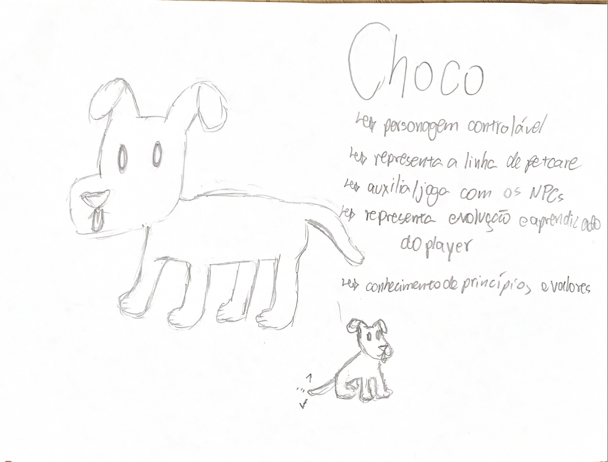

Fonte: Autoria própria (2025)

 

	
Figura 10 - Personagens NPCs que apoiarão a jornada de Choco durante o jogo

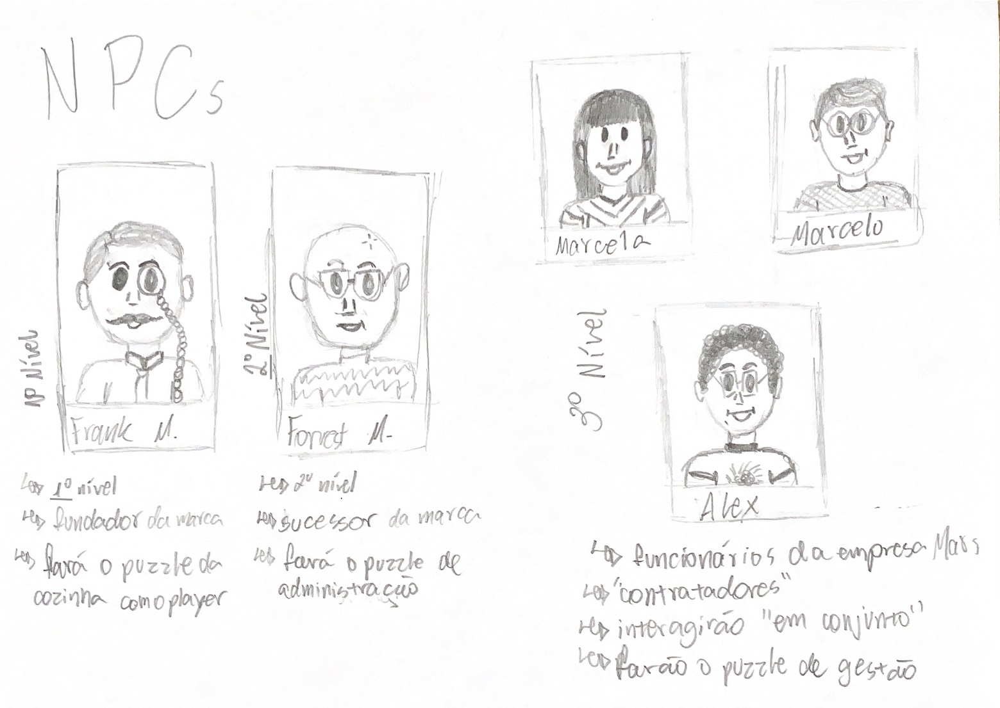

Fonte: Autoria própria (2025)

 

Figura 11 - Conceito do mapa do jogo, mostrando as diferentes “ilhas" que ilustram os níveis

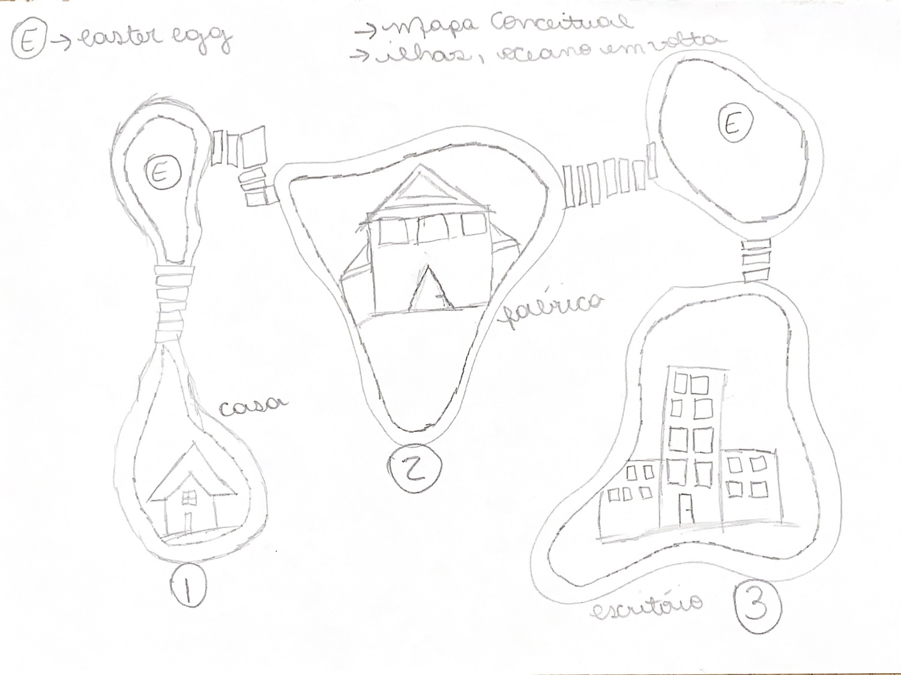

Fonte: Autoria própria (2025)

 

Figura 12 - Visão do interior da casa de Frank Mars

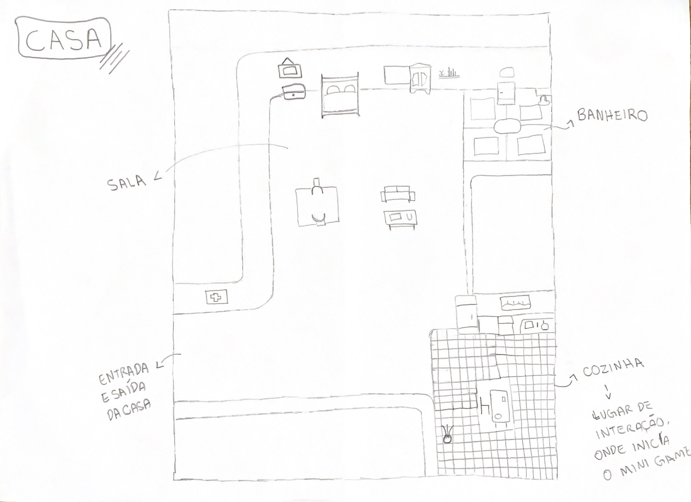

Fonte: Autoria própria (2025)

 

Figura 13 - Cozinha, onde se passa o primeiro puzzle

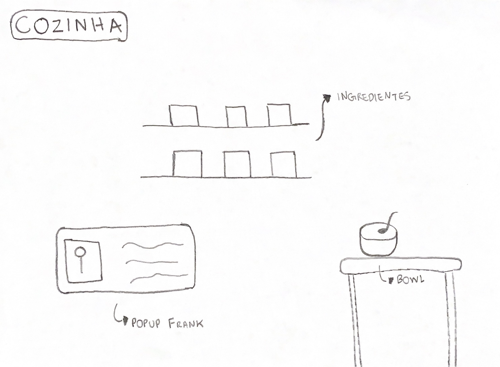

Fonte: Autoria própria (2025)

 

Figura 14 - A primeira fábrica da Mars, onde se passa o segundo nível

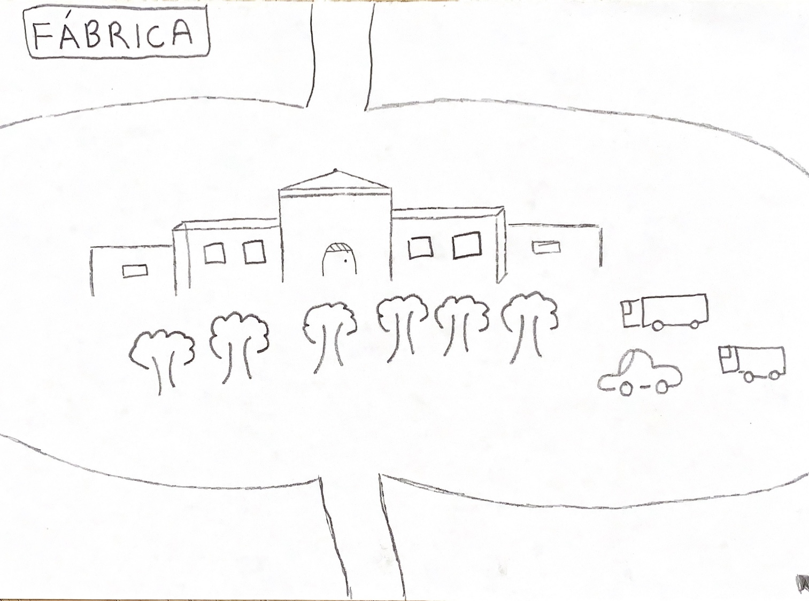

Fonte: Autoria própria (2025)

 

Figura 15 - Escritório da Mars, onde se passa o terceiro nível

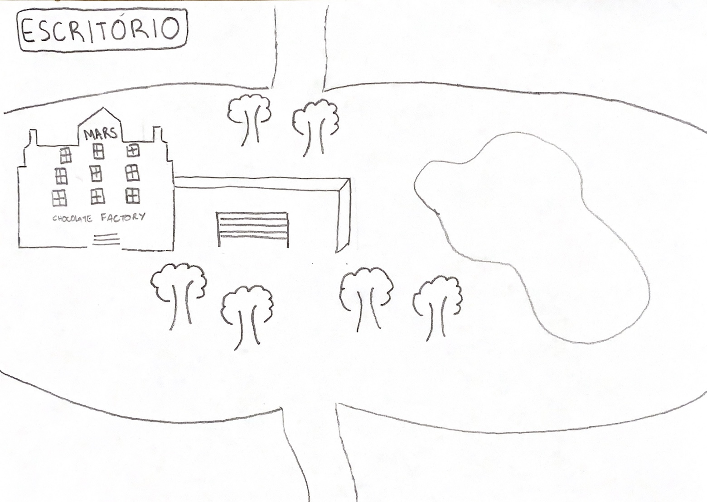

Fonte: Autoria própria (2025)

 

Figura 16 - Tela do nível 2

Fonte: Autoria própria com uso de IA (2025)

 

Figura 17 - Tela do nível 2 (escolha 1)

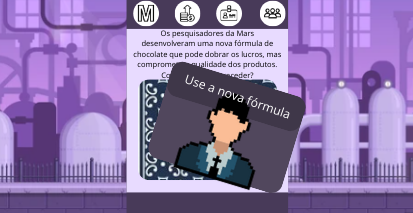

Fonte: Autoria própria com uso de IA (2025)

 

Figura 18 - Tela do nível 2 (escolha 2)

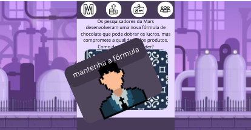

Fonte: Autoria própria com uso de IA (2025)

 

### 3.3.5. Trilha sonora

A trilha sonora do jogo é composta por cinco faixas originais, criadas exclusivamente para ambientar e reforçar a imersão nas diferentes etapas da experiência do jogador. Cada trilha é associada a um momento específico do jogo, variando desde o tutorial até a cena final. Todas as músicas foram compostas pela própria equipe de desenvolvimento.

Tabela 2 - Trilha sonora

\# | título | ocorrência | autoria  
--- | --- | --- | ---  
1 | tema do mapa/tutorial | tutorial e movimentação no mapa | própria  
2 | tema do nível 1 | minigame/cena do nível 1 | própria  
3 | tema do nível 2 | minigame/cena do nível 2 | própria  
4 | tema do nível 3 | minigame/cena do nível 3 | própria  
5 | tema da cena final | cena de encerramento do jogo | própria  

Fonte: Autoria Própria (2025)

## 3.4. Gameflow (Diagrama de cenas) 

Figura 19 - Diagrama de cenas

Fonte: Autoria própria (2025)

 

#### Tela Inicial

&emsp;Ao iniciar o jogo, encontramos a tela de título, onde o player possui as opções de “jogar", “sair" e "configurações. O botão “jogar" leva à primeira tela do jogo, o botão “sair" fecha a página e as configurações tem as configurações de volume.  

#### Tela instrução

&emsp;Ao entrar no jogo, o jogador será direcionado para a tela de instruções, onde poderá movimentar o Choco livremente enquanto um pop-up exibe as principais orientações de jogabilidade.

#### Mapa do Mundo

&emsp;Após a tela de instruções, o personagem segue por um caminho suave que o conduz até o mapa principal do jogo, um cenário vibrante, com cores vivas e elementos que despertam a curiosidade. Placas estilizadas marcam as datas de cada nível, enquanto três edifícios distintos se destacam no cenário, representando as três fases do jogo. No início, apenas a casa de Frank está acessível, sinalizando o ponto de partida na jornada. Ao completar essa primeira fase, um novo local do mapa se ilumina e é desbloqueado, revelando a próxima etapa. O progresso continua assim, fase após fase, à medida que o jogador avança pela narrativa e descobre novos desafios.

#### Casa de Frank

&emsp;Ao entrar na casa de Frank, com sua estética encantadora inspirada no ano de 1911 — chão de azulejos quadriculados em preto e branco, móveis robustos de madeira escura e detalhes vintage por todos os cantos — Choco é surpreendido por um pop-up que surge diante dele. Nele, o próprio Frank Mars, em versão NPC, aparece com um sorriso simpático e um ar de urgência. Ele pede ajuda e explica, com precisão, como medir corretamente os ingredientes para produzir um chocolate de altíssima qualidade. O desafio está lançado: Choco precisa definir a quantidade exata de três ingredientes essenciais para garantir o sabor perfeito.

#### A Fábrica 

&emsp;Após concluir o puzzle da casa do Frank, o jogador explora novamente o mapa e entra na próxima fase: uma fábrica de chocolates ambientada em 1929, marcando o início da trajetória da marca Mars.
 Nesta cena, o cenário é composto por uma imagem estática da fábrica ao fundo, enquanto o puzzle é apresentado em primeiro plano, com uma interface totalmente jogável e funcional.
 O jogador assume o papel de administrador da fábrica, sendo responsável por gerenciar a produção de forma estratégica, enquanto interage com os valores da marca de maneira envolvente e educativa.
 A mecânica do jogo é baseada em um sistema de cartas ao estilo Pokémon, cada uma contendo uma imagem central e um texto descritivo na parte inferior.
 Ao completar o desafio, o jogador desbloqueia a próxima fase da jornada.

#### A Empresa

&emsp;Após concluir os desafios da Casa e da Fábrica, o personagem percorre novamente o mapa e, por fim, Choco chega à Empresa, o último nível, ambientado em um cenário futurista.
 Inspirado em um escritório real da Mars, esse ambiente traz elementos estéticos marcantes: setores distintos como Petcare, Global Services e Snacking, a presença de pets no escritório, cores representativas da marca e, claro, chocolates icônicos espalhados pelo cenário.
 O puzzle ou minigame segue a lógica das mecânicas anteriores, mas com um diferencial: ao final, o jogador recebe uma nota que indica se foi aprovado ou não. Em caso de aprovação, Choco conquista os princípios de mutualidade e liberdade, simbolizando que está finalmente pronto para a entrevista.

#### Desfecho da Experiência

 &emsp;A jornada de Choco pelos três estágios do jogo representa, metaforicamente, o percurso de um candidato no processo seletivo da Mars. Cada fase dissolve gradualmente o nervosismo e constrói a confiança: começamos na Casa de Frank, enfrentando desafios práticos que desconstroem os primeiros medos; seguimos para a Fábrica de 1929, onde mergulhamos na história e valores da marca; e finalmente chegamos à Empresa do futuro, onde somos testados em uma posição temporária de gerente. Ao sermos bem-sucedidos, conquistamos os princípios essenciais de mutualidade e liberdade, demonstrando que o candidato está emocionalmente preparado para encarar a entrevista com autenticidade e tranquilidade.

## 3.5. Regras do jogo 

&emsp;Regras do jogo são instruções que definem como um jogo deve ser jogado, estabelecendo o objetivo, as ações permitidas ou proibidas, a forma como o jogo começa, se desenvolve e termina, além dos critérios de pontuação e vitória. Elas garantem uma experiência justa, organizada e divertida para todos os participantes. 

### Regras do Nível 1: Produção de Chocolate com Frank Mars
####  Objetivo do Jogo

&emsp;O objetivo principal do jogador no Nível 1 é ajudar Frank Mars a produzir um chocolate de alta qualidade, escolhendo cuidadosamente a quantidade correta de cada ingrediente para alcançar o padrão definido por Frank. O jogador precisa equilibrar precisão e tempo para garantir que o doce atenda às expectativas de qualidade.

###  Mecânica Central
- O jogador assume o controle do processo de produção, precisando clicar no momento exato para adicionar corretamente cada ingrediente à receita.
- Cada ingrediente possui uma **barra de precisão** com uma área **verde** (acerto) e uma área **vermelha** (erro).
- Para obter um resultado ideal, o jogador deve clicar quando o indicador estiver posicionado dentro da área verde, garantindo a quantidade exata do ingrediente.
- **Cliques fora da área verde** resultarão em uma adição errada, afetando a qualidade final do chocolate.
### Exemplo de situação:
*"Frank pede que você adicione leite à mistura. Se o toque for preciso e cair na área verde da barra de precisão, o leite será adicionado na medida exata, mantendo a qualidade da receita. Se errar, a mistura ficará desbalanceada e o sabor do chocolate será comprometido."*

###  Regras de Progresso e Fim de Jogo
- Se o jogador acertar a quantidade correta dos ingredientes e atingir o padrão desejado, **Frank elogiará o resultado** e o jogador **avançará para o próximo nível**, desbloqueando mais uma etapa da história da empresa.
- Se o jogador errar a quantidade de ingredientes e o doce não atingir o padrão estabelecido por Frank, o **NPC dará um feedback**, pedindo que o jogador refaça a receita para tentar novamente.
- A **pontuação final** do jogador será determinada com base na precisão, **variando de 1 a 3 estrelas**.
---
##  Propósito Pedagógico e Temático
Esse nível reforça a importância da **precisão** e do **controle de qualidade** na produção de alimentos, destacando como cada detalhe conta para garantir um produto final satisfatório.
Além disso, o jogador experimenta o desafio de seguir **padrões rigorosos**, refletindo a preocupação de **Frank Mars** pela **excelência na fabricação de chocolates**.

## Regras do Nível 2: Administração da Fábrica Mars
###  Objetivo do Jogo 

O objetivo principal do jogador no Nível 2 é administrar uma fábrica da Mars, tomando decisões estratégicas com 15 cartas diferentes para equilibrar quatro parâmetros principais: lucro, valores da Mars, satisfação dos consumidores e satisfação dos colaboradores.

### Mecânica Central
- O jogador terá acesso a um **baralho de cartas de decisão**.
- A cada turno, o jogador visualizará **a carta do topo do baralho**, que apresenta um **dilema** ou **situação** a ser resolvida.
- Para cada carta, o jogador deverá **escolher entre duas opções**, **à esquerda** ou **à direita**.
- Cada escolha afetará de forma diferente os quatro parâmetros da fábrica.
Essa dinâmica representa **as decisões diárias na gestão de uma fábrica da Mars**.
###  Carta de exemplo:
*"Os pesquisadores da Mars desenvolveram uma nova fórmula de chocolate que pode dobrar os lucros, mas compromete a qualidade do produto. Como devemos proceder?"*
- **Arrastar para a direita** (aceitar a nova fórmula):
  -  **Lucro aumenta**
  -  **Valores da Mars diminuem**
  -  **Satisfação dos consumidores diminui**
- **Arrastar para a esquerda** (manter a fórmula atual):
  -  **Lucro diminui**
  -  **Valores da Mars aumentam**
  -  **Satisfação dos consumidores aumenta**
---
##  Regras de Progresso e Fim de Jogo
- O jogador avança no jogo enquanto consegue **manter todos os parâmetros dentro de uma faixa de segurança, que não pode chegar ao máximo(100) ou zerar a barra**.
- Caso algum dos quatro parâmetros atinja o **valor máximo ou mínimo**, a partida é encerrada e o jogador **recebe um feedback** sobre sua gestão.
- "O jogo continua enquanto todos os parâmetros estiverem dentro da faixa de segurança e o tempo não for excedido. Se o jogador conseguir jogar todas as 15 cartas sem que nenhum parâmetro ultrapasse o limite máximo ou chegue a zero, a partida é finalizada com sucesso."
- O tempo de permanência no jogo depende da habilidade do jogador em manter o equilíbrio entre os parâmetros ao longo das rodadas.
---
###  Propósito Pedagógico e Temático

Esse nível tem como objetivo mostrar a complexidade de se administrar uma empresa de forma ética e equilibrada. O jogador aprende, na prática, que cada decisão gera impactos simultâneos e interdependentes, exigindo uma visão sistêmica — ou seja, a capacidade de compreender como cada ação afeta o todo. Além disso, é essencial desenvolver habilidades de tomada de decisão estratégica, avaliando riscos, valores e consequências de curto e longo prazo.

## Regras do Nível 3: Escritório da Mars - Mutualidade e Liberdade
### Objetivo do Jogo

O objetivo principal do jogador no Nível 3 é assumir o papel de gerente na Mars do futuro, demonstrando sua capacidade de liderança e gestão de equipes em um ambiente dinâmico e desafiador.
O jogador deve equilibrar **eficiência** na entrega de projetos com a construção de **equipes coesas** e **alinhadas aos valores da empresa**: **Mutualidade e Liberdade**.

###  Mecânica Central
O jogador terá a liberdade de **montar equipes para diferentes projetos**, selecionando funcionários com diferentes habilidades:
-  **Hard Skills**: Especialistas técnicos, focados em **resultados e eficiência**.
-  **Equilibrados**: Profissionais versáteis, com **habilidades técnicas e interpessoais**.
-  **Soft Skills**: Colaboradores com foco em **comunicação, colaboração e resolução de conflitos**.
Cada projeto apresenta **desafios únicos**, exigindo **diferentes combinações de habilidades e tamanhos de equipe**.
O jogador deverá **analisar as necessidades de cada projeto** e tomar **decisões estratégicas** para montar a equipe ideal.
---
###  Regras de Progresso e Fim de Jogo
- O jogador avança ao completar os projetos com sucesso e obter **boas avaliações de desempenho**.
- Se não conseguir montar uma equipe equilibrada com ótimo desempenho, deverá refazer a formação da equipe
- Ao ser aprovado, o jogador recebe **um feedback positivo** e internaliza os princípios de **Mutualidade e Liberdade**, ficando finalmente pronto para a **entrevista final**.
---
##  Propósito Pedagógico e Temático
Este nível reforça a importância da liderança colaborativa, da gestão de equipes e da tomada de decisão estratégica em um ambiente corporativo.
O jogador aprende, na prática, que o sucesso de um projeto depende da combinação certa de habilidades e da cooperação entre os membros da equipe.

---

## 3.6. Mecânicas do jogo
### Mecânicas Nível 1

O jogo segue uma mecânica de precisão baseada no tempo certo de clique para adicionar ingredientes corretamente à receita. Abaixo estão descritos os controles e as interações disponíveis para o jogador.

#### Controles e Interações

##### Toque na tela
- O jogador clica no mouse no momento certo para confirmar a adição do ingrediente.  
- Se o clique ocorrer dentro da área verde da barra, o ingrediente é adicionado corretamente.  
- Se o clique ocorrer fora da área verde, a quantidade do ingrediente ficará errada, afetando a qualidade da receita.  

##### Botão "Continuar"
- Após o término do minigame, o jogador pode avançar para a próxima fase.  

##### Botão "Tentar novamente"
- O jogador pode reiniciar o minigame para tentar melhorar sua pontuação.  

### Efeitos visuais e feedbacks

- O jogo exibe uma barra de precisão com uma área vermelha (erro) e uma área verde (acerto).  
- Um indicador se move pela barra, mostrando o momento ideal para tocar.  
- Um pop-up orienta o jogador no tutorial e faz comentários encorajadores durante o minigame.  
- A precisão do jogador é avaliada no final da fase, resultando em uma pontuação de 1 a 3 estrelas, conforme o desempenho.  

Esse sistema de interação desafia o jogador a ter bom reflexo e precisão, garantindo que os ingredientes sejam adicionados corretamente para obter o melhor resultado na receita.  

---

### Mecânicas Nível 2

O jogo segue uma mecânica de tomada de decisão baseada em deslizar cartas para a esquerda ou para a direita. Abaixo estão descritos os controles e as interações disponíveis para o jogador:

#### Controles e Interações

##### Arrastar carta para a esquerda  
- A carta é deslocada visualmente para o lado esquerdo da tela.  
- Ao soltar a carta na região esquerda, a decisão correspondente é tomada.  
- Os parâmetros do jogo (**lucro**, **princípios Mars**, **funcionários** e **público**) são ajustados com base na decisão escolhida.  

##### Arrastar carta para a direita  
- A carta é deslocada visualmente para o lado direito da tela.  
- Ao soltar a carta na região direita, a decisão correspondente é tomada.  
- Os parâmetros do jogo (**lucro**, **princípios Mars**, **funcionários** e **público**) são ajustados com base na decisão escolhida.  

##### Soltar a carta no centro do baralho  
- Nenhuma decisão é tomada.  
- A carta retorna à posição inicial.  

##### Efeitos visuais e feedbacks  

- Ao tomar uma decisão, uma animação de transição ocorre antes da próxima carta ser exibida.  
- Os indicadores de status dos parâmetros do jogo são atualizados em tempo real após cada decisão.  

Esse sistema de interação simples e intuitivo permite ao jogador tomar decisões rápidas e estratégicas, impactando o desenrolar do jogo e os equilíbrios entre os quatro parâmetros principais.  

---

### Mecânicas Nível 3: Escritório da Mars - Mutualidade e Liberdade  

O jogo segue uma mecânica de gerenciamento e tomada de decisão estratégica no contexto de projetos corporativos. Abaixo estão descritos os controles, as interações e a disposição na tela:  

### Controles e Interações  

#### Selecionar Funcionários para a Equipe  
- **Onde aparece na tela:** A tela exibirá uma área central com a lista de funcionários disponíveis para o projeto, ao lado de informações sobre suas habilidades (**Hard Skills**, **Equilibrados** e **Soft Skills**).  
- O jogador poderá navegar entre os candidatos para visualizar todas as opções antes de tomar uma decisão, ajustando a equipe ideal conforme necessário.
- O jogador escolhe os funcionários com base em suas habilidades.  
- A seleção deve ser estratégica, considerando o tipo de projeto e a combinação ideal de habilidades para a equipe.  

#### Montar Equipes para Projetos  
- **Onde aparece na tela:** No topo da tela, aparecerá a descrição do projeto atual, com os requisitos específicos (**número de funcionários e tipos de habilidades necessárias**).  
- A área de seleção de funcionários estará abaixo, e o jogador arrastará os trabalhadores para montar a equipe.   
- O jogador monta equipes para os projetos que chegam em sequência.  
- Cada projeto possui requisitos específicos quanto ao número de funcionários e suas habilidades.  
- O jogador pode ver a sinergia entre os membros da equipe à medida que os escolhe.  

#### Avaliação de Desempenho Após Projetos  
 
- Ao concluir um projeto, o jogador recebe uma avaliação visual e textual.  
- A avaliação afeta o progresso do jogador no jogo e sua capacidade de avançar para a próxima fase.  

#### Feedback ao Final de Cada Setor  
- **Onde aparece na tela:** Ao final de cada setor de contratação, uma janela aparece no topo da tela com o feedback sobre a equipe escolhida.  
- Abaixo dessa janela, o jogador pode visualizar um resumo das avaliações dos projetos completados no dia.   
- Concluídos os três setores, verifica-se se o candidato está preparado para enfrentar a entrevista final. 

#### Efeitos Visuais e Feedbacks  

- Todos os possíveis colaboradores, e suas habilidades muito bem representados em cada card de contratação. 
- Feedbacks visuais, como indicadores de desempenho, aparecerão na parte superior da tela, ajudando o jogador a ajustar suas decisões e melhorar sua equipe.
- Pop-up final mostrando se a equipe atendeu aos requisitos ou se precisa tentar novamente.  

Este sistema de interação permite que o jogador seja desafiado a tomar decisões rápidas e estratégicas, impactando o sucesso dos projetos e a construção de equipes eficientes e coesas, enquanto recebe feedbacks claros e visualmente organizados.  

## 3.7. Implementação Matemática de Animação/Movimento

Nesta seção, detalhamos a implementação matemática da movimentação e animação do personagem, com ênfase no pulo parabólico e no deslocamento horizontal. A movimentação segue princípios da cinemática bidimensional, aplicando **Movimento Uniforme (MU)** no eixo horizontal (X) e **Movimento Uniformemente Variado (MUV)** no eixo vertical (Y), com velocidade inicial nula no eixo vertical ao iniciar o pulo. Esta escolha reflete a mecânica típica de jogos de plataforma, onde o movimento lateral é constante e o pulo segue a influência da gravidade.

### 3.7.1. Movimento Horizontal (MU)
O deslocamento horizontal do personagem é controlado pelas teclas ← (esquerda) e → (direita), caracterizando um movimento uniforme, ou seja, com velocidade constante.

Os seguintes parâmetros são utilizados para controlar a animação e o movimento do personagem:

- **Posição Inicial (x0, y0):** Coordenadas iniciais do sprite do jogador no plano cartesiano (em pixels).
- **Posição Final (x, y):** Para o eixo X, a posição final é dinâmica, dependente da entrada do jogador (teclas ← e →). Para o eixo Y, a posição final é determinada pelo ponto de retorno ao chão após o pulo.
- **Duração Total (tempo da animação em segundos):** Definida como `CONFIG.PULO.TEMPO_MAXIMO`, representando o tempo total do pulo, do início ao retorno ao chão.
- **Elemento Gráfico:** O sprite do jogador (`jogadorSprite`), que é o objeto animado no jogo.

### 3.8.2. Movimento Horizontal (MU)

O deslocamento horizontal é controlado pelas teclas ← (esquerda) e → (direita), caracterizando um **Movimento Uniforme (MU)**, ou seja, com velocidade constante. A escolha do eixo X para MU reflete a necessidade de um movimento lateral previsível e contínuo.

#### Equações do Movimento Horizontal

- **Velocidade Horizontal (vx):**
  
  
  
  - Para movimento à direita:
    
    
  - Para movimento à esquerda:
    
    

- **Posição Horizontal (x(t)):**
  
  

  Onde:
  - **x(t):** Posição horizontal no tempo t.
  - **x(0):** Posição inicial no eixo x.
  - **vx:** Velocidade horizontal.
  - **t:** Tempo decorrido.

### 3.7.2. Movimento Vertical (MUV)

O movimento vertical é ativado pela tecla **Espaço** (pulo) e influenciado pela gravidade, caracterizando um **Movimento Uniformemente Variado (MUV)**. A velocidade inicial no eixo Y é nula no momento do pulo, e a aceleração gravitacional atua ao longo do tempo.

#### Equações do Movimento Vertical

- **Aceleração Vertical (ay):** a_y = Constante
  - \( a_y \) é positiva, pois a gravidade atua para baixo.

- **Velocidade Vertical (vy(t)):**

  
  
  Onde:
  - **vy(t):** Velocidade vertical no tempo t.
  - **vy0:** Velocidade vertical inicial (negativa no salto, pois o personagem sobe).
  - **ay:** Aceleração da gravidade (positiva, pois atua para baixo).
  - **t:** Tempo decorrido desde o início do pulo.

- **Posição Vertical (y(t)):**

  
  
  Onde:
  - **y(t):** Posição vertical no tempo t.
  - **y0:** Posição inicial no eixo y.
  - **vy0:** Velocidade vertical inicial.
  - **ay:** Aceleração da gravidade.
  - **t:** Tempo decorrido desde o início do pulo.

### 3.7.3. Implementação no Código
Nesta seção, explicamos como as equações acima são aplicadas no código do jogo, detalhando a lógica da movimentação e do pulo.

#### Inicialização (Create):
No início do jogo, as variáveis relacionadas à movimentação e ao pulo do personagem são definidas:

#### Atualização (Update):
Durante a execução do jogo, a mecânica do pulo e da movimentação horizontal é constantemente atualizada com base nas equações matemáticas descritas anteriormente:

Essa implementação garante um movimento realista e fluido do personagem, respeitando as leis da física aplicadas ao jogo.

# 4. Desenvolvimento do Jogo

## 4.1. Desenvolvimento preliminar do jogo 

1. Estrutura do Projeto
O projeto foi estruturado de forma modular, separando responsabilidades em diferentes arquivos para facilitar a manutenção e evolução do código. Os principais arquivos são:

main.js: Arquivo principal que inicializa o jogo e gerencia as cenas.
menu.js: Arquivo responsável pela implementação do menu inicial.
game.js: Arquivo que contém a lógica principal do jogo, incluindo movimentação e animações.
index.html: Configurações da página web e integração com o main.js.
2. Funcionalidades Implementadas
2.1. Mecânica de Movimentação
A movimentação do personagem foi desenvolvida para ser fluida e responsiva, utilizando spritesheets para as animações. O processo seguiu os seguintes passos:

Criação de Spritesheets:

A ferramenta Leshy Labs foi utilizada para gerar os arquivos .png (imagens) e .json (metadados). Esses arquivos foram configurados no Phaser utilizando a ferramenta Atlas.
Configuração das Animações:

A função this.anims.create foi utilizada para definir as animações, mapeando os quadros do spritesheet com base no arquivo .json. Por exemplo:

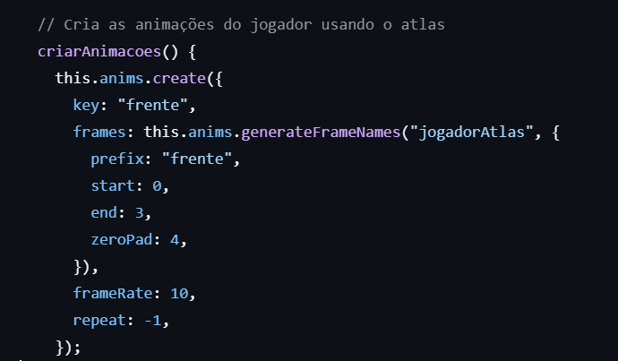

Controle de Movimento:

O controle foi implementado utilizando as teclas W, A, S, D e as setas direcionais do teclado. As entradas foram capturadas na função create():

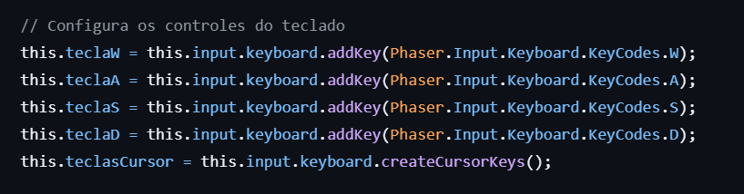

A lógica de movimentação foi implementada na função update(), ajustando a velocidade e iniciando a animação correspondente quando uma tecla é pressionada:

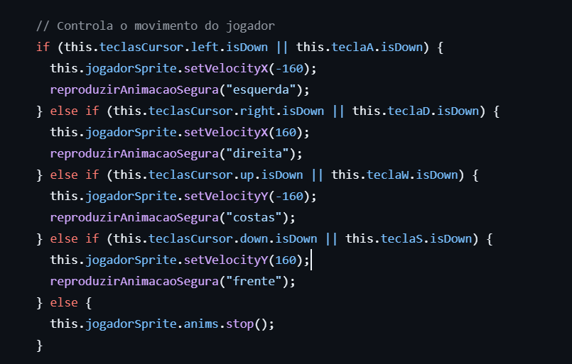

2.2. Menu Inicial
O menu inicial foi implementado para servir como ponto de entrada do jogo. Suas funcionalidades incluem:

Verificação da interação com o botão de início:

Quando o botão é pressionado, a cena do jogo é carregada:

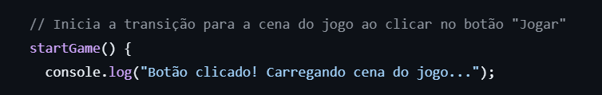

3. Fluxo de Execução do Código
index.html:

Configura a página web e carrega o arquivo main.js.
main.js:

Inicializa o Phaser e define as configurações do jogo.
Importa as cenas menu.js e game.js.
menu.js:

Exibe o menu inicial e detecta a interação do usuário com o botão de início.
game.js:

Contém a lógica principal do jogo, incluindo:
Configuração das animações.
Controle da movimentação do personagem.

4. Considerações finais
Na primeira sprint, foram entregues as seguintes funcionalidades:

Mecânica de movimentação do personagem com animações fluídas.
Sistema de entrada de comandos responsivo, suportando teclado (WASD e setas).
Menu inicial funcional com transição para o gameplay.
Estrutura modular do código para facilitar futuras implementações.
Esse progresso representa um alicerce sólido para o desenvolvimento de funcionalidades mais avançadas, como interações com o cenário e novos elementos de gameplay, nas próximas sprints.
*

## 4.2. Desenvolvimento básico do jogo 

### 1. Descrição do desenvolvimento

No sprint 2, foi entregue a versão básica do jogo, composta por três cenas principais: SceneInicial (tela de menu), SceneJogo (mapa principal) e SceneQuarto (interior do quarto). O objetivo foi criar uma estrutura funcional que permita ao jogador navegar entre as cenas, controlar o personagem principal (um cachorro), interagir com elementos básicos e estabelecer as bases para futuras expansões. Abaixo, detalho o que foi implementado em termos de código e jogabilidade:
1.1 SceneInicial (Tela de Menu):
Código: Implementada uma tela inicial com fundo, logo e três botões interativos ("Jogar", "Configurações" e "Sair"). O botão "Jogar" inicia a transição para SceneJogo com efeitos de pixelização e fade out, enquanto "Configurações" é um placeholder e "Sair" tenta fechar a aba ou redireciona para uma URL externa.
Jogo: Fornece uma interface inicial amigável para o jogador começar a experiência ou sair do jogo.
1.2 SceneJogo (Mapa Principal):
Código: Desenvolvido um mapa com fundo, o jogadorSprite (cachorro) controlado por WASD/setas, um NPC interativo (Franklin Mars) com popup e diálogo, colisores invisíveis para obstáculos e um botão invisível para transição à SceneQuarto.
Jogo: Permite ao jogador explorar o mapa, interagir com o NPC para receber uma mensagem inicial e acessar o quarto ao clicar em uma área específica.
1.3 SceneQuarto (Interior do Quarto):
Código: Criado um cenário interno com fundo, o jogadorSprite inicializado sem caixa preta (frame "frente0000"), múltiplos colisores para móveis/paredes e um retângulo invisível que retorna à SceneJogo ao ser colidido.
Jogo: Oferece um ambiente interno explorável com barreiras físicas e uma saída para voltar ao mapa principal.

### 2. Ilustrações (Prints de Tela Simulados)

2.1. Print 1: SceneInicial

Figura 20 - Menu Inicial

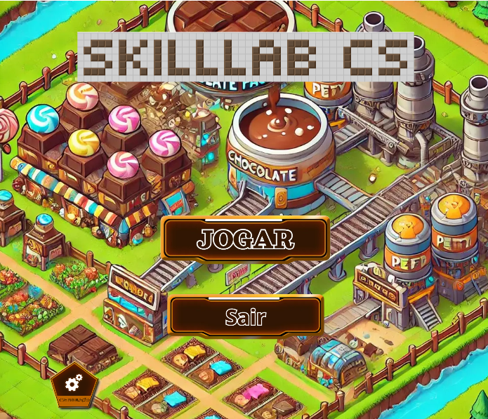

Fonte: Autoria própria com uso de IA (2025)

 Descrição: A tela mostra uma imagem de fundo de uma fábrica de chocolate, um logo centralizado no topo (logo.png) com escala 0.5, e três botões: "Jogar" em (350, 350), "Sair" em (350, 450) e "Configurações" em (100, 550). Os botões têm escalas de 0.4 e 0.3, respectivamente, e são visíveis sobre o fundo." 

 

2.2. Print 2: SceneJogo

Figura 21 - Mapa Principal

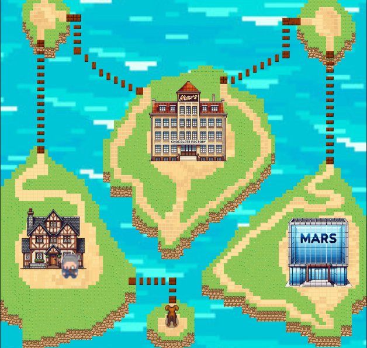

Fonte: Autoria própria com uso de tilesets (2025)

Descrição: A tela exibe o fundo do mapa (Mapa_design.png), o cachorro (jogadorSprite) em (330, 545) olhando para baixo, o NPC Franklin Mars em (155, 455) com um popup "Clique em mim" visível acima dele (quando o jogador está próximo), e áreas invisíveis de colisão bloqueando o movimento.

 

2.3. Print 3: SceneQuarto

Figura 22 - Interior do Quarto

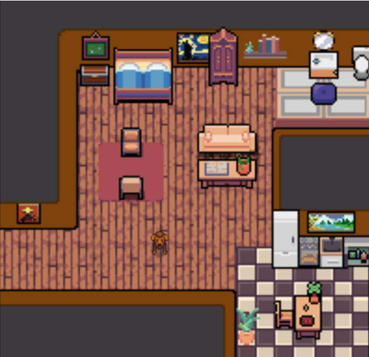

Fonte: Autoria própria com uso de tilesets (2025)

Descrição: A tela mostra o fundo do quarto (casab.png), o cachorro em (300, 200) olhando para baixo, e o retângulo invisível perto da "parede de entrada superior" (70, 360). Colisores bloqueiam o acesso a móveis como cama e armário.

 

### 3. Entregas em Termos de Código

3.1. Navegação entre Cenas: Implementada transição de SceneInicial para SceneJogo via botão "Jogar":

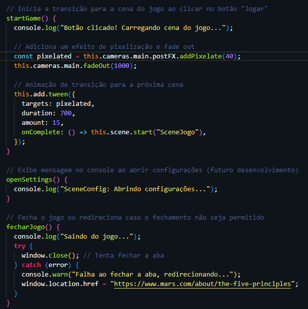

De SceneJogo para SceneQuarto via botão invisível em (135, 420):

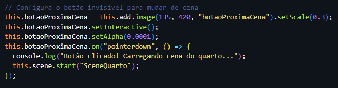

De SceneQuarto para SceneJogo via colisão com portaSaida em (70, 360):

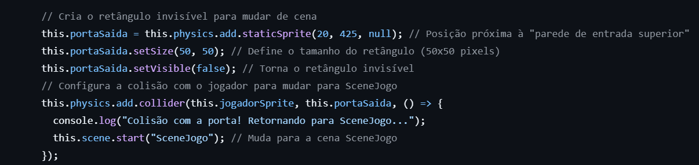

3.2. Interatividade: 

NPC na SceneJogo exibe popup de proximidade e diálogo:

- NPC:

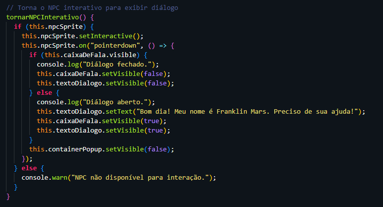

- Popup de proximidade:

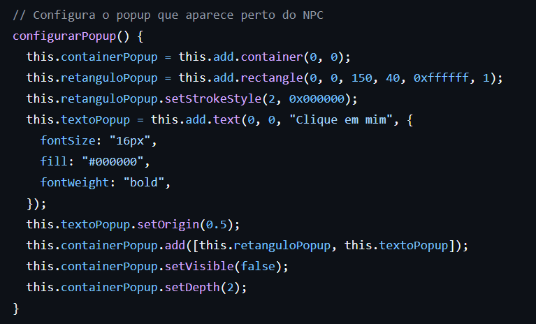

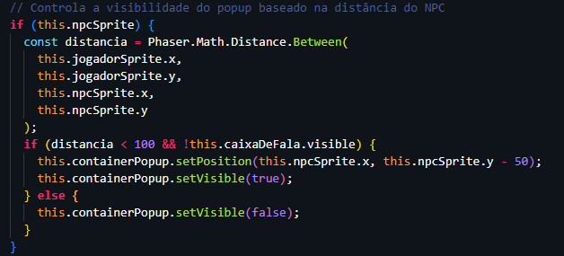

- Diálogo:

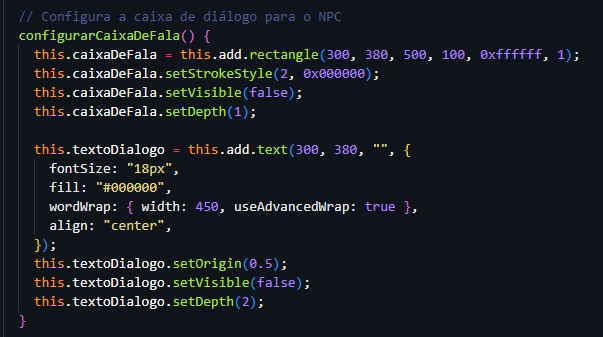

Botões no menu têm ações definidas:

Colisores em ambas as cenas impedem atravessamento de obstáculos:

- Colisores do mapa principal:

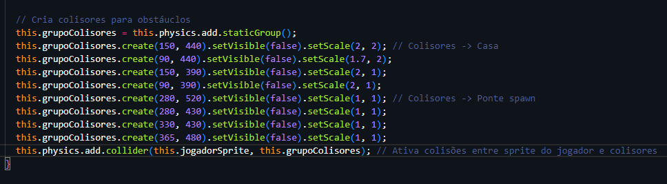

- Colisores da casa

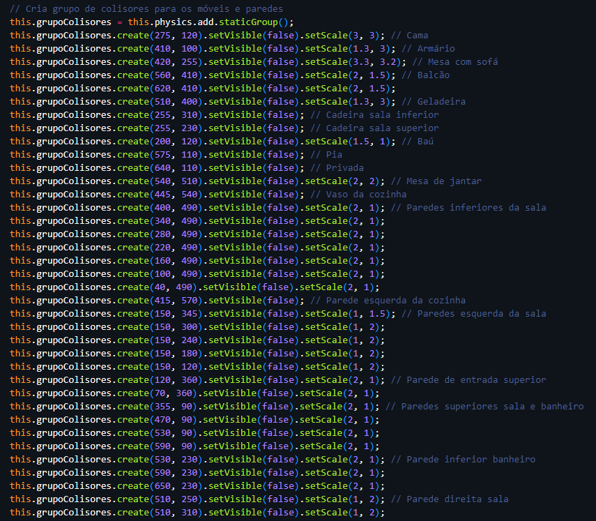

3.3. Efeitos Visuais: Transição da SceneInicial para SceneJogo inclui pixelização e fade out:

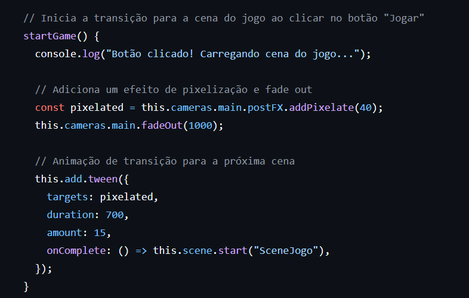

### 4. Dificuldades Enfrentadas

4.1. Caixa Preta no jogadorSprite: Na SceneQuarto, o sprite inicialmente aparecia como uma caixa preta até o movimento ser ativado. Resolvido ao definir um frame inicial ("frente0000") no create.

- Impacto: Exigiu ajustes na inicialização do sprite e verificação de texturas/animações.

4.2. Posicionamento de Colisores: Ajustar as coordenadas e tamanhos dos colisores em SceneQuarto para alinhar com o fundo (casab.png) foi trabalhoso, pois o layout não era intuitivo sem feedback visual direto.

- Impacto: Necessitou de testes iterativos para garantir bloqueios eficazes.

4.3. Transição de Cenas: Garantir que os recursos (atlas, animações) carregados na SceneJogo fossem reutilizados na SceneQuarto exigiu atenção à ordem de carregamento e nomenclatura consistente.

- Impacto: Pequenos ajustes na chave do atlas (jogadorAtlas vs. "boneco").

### 5. Próximos Passos

5.1. Melhorar Feedback Visual:

- Adicionar indicadores visuais temporários (ex.: retângulos coloridos) para colisores e áreas de transição durante o desenvolvimento, removendo-os na versão final.

- Implementar animações ou sons para transições de cena.

5.2. Expandir Interatividade:

- Desenvolver a funcionalidade do botão "Configurações" na SceneInicial com uma cena dedicada (SceneConfig).

- Adicionar mais interações no quarto (ex.: objetos coletáveis ou NPCs adicionais).

5.3. Refinar Layout:

- Ajustar posições de colisores e áreas de transição com base em testes de jogabilidade e no design final do fundo.

- Otimizar o tamanho da tela e escalas para consistência entre cenas.

5.4. Testes e Depuração:

- Executar os casos de teste fornecidos para garantir robustez e corrigir eventuais bugs (ex.: falhas na transição ou colisões inconsistentes).

- Adicionar logs adicionais para monitorar o estado do jogo em tempo real.

## 4.3. Desenvolvimento intermediário do jogo

### 1. Descrição do desenvolvimento

No sprint 3, foi entregue a versão intermediária do jogo, com mais quatro cenas principais: SceneTutorial (encontro com NPC e apresentação da missão), SceneCozinha (jogo do primeiro nível, com tutorial), ScenePuzzleCozinhaManteiga (cena de seleção da manteiga), ScenePuzzleAcucar (cena de seleção do açúcar) e ScenePuzzleCozinhaCacau (cena de seleção do cacau). O objetivo, durante a sprint, foi implementar o primeiro nível, complementando as cenas anteriores e dando continuidade ao progresso do jogo. Além disso, atualizamos o design do mapa e do interior da casa, aumentando a coesão de estilos. Abaixo, detalho o que foi implementado em termos de código e jogabilidade:

1.1. SceneTutorial

Na cena, o personagem controlável encontra com NPC de Frank Mars, e aparece um pop up de apresentação do jogo e de sua missão. 

1.2. SceneJogo

Na cena, o personagem controlável tem acesso ao mapa do jogo e consegue acessar as fases com zoom e câmera que acompanha ele em terceira pessoa.

1.3. SceneCozinha

Na cena, o personagem entra em um cenário de cozinha como fundo, o player interage com o NPC de Frank Mars, que dará instruções e dicas sobre o minigame que será iniciado, além de falar sobre seus princípios, conectados com os cinco princípios da Mars. Durante esse game, o player deverá escolher a quantidade correta dos ingredientes para uma receita de chocolate, recebendo um feedback de acordo, nessa tela temos um pop-up de tutorial e a cada vez que clicarmos em um ingrediente iniciaremos o minigame de acertar a localização da seta na barra.

1.4. ScenePuzzleCozinhaCacau

Abre o pop up e proporciona a mecânica da barra de seleção de quantidade de cacau e somatória de pontos para o game.

1.5. ScenePuzzleCozinhaManteiga

Abre o pop up e proporciona a mecânica da barra de seleção de quantidade de manteiga e somatória de pontos para o game.

.

1.6. ScenePuzzleCozinhaAcucar
 
Abre o pop up e proporciona a mecânica da barra de seleção de quantidade de açúcar e somatória de pontos para o game.

### 2. Ilustrações (Prints de Tela Simulados)

2.1. SceneTutorial

Figura 23 - Encontro com NPC e apresentação da missão

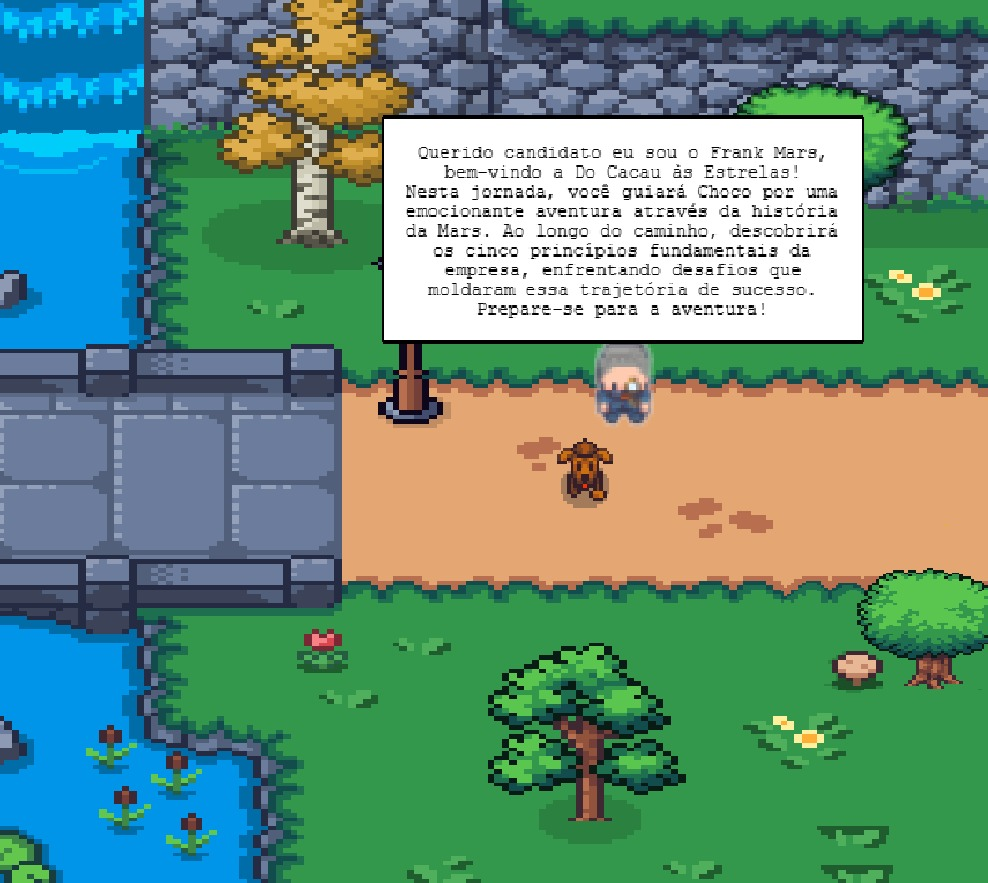
  
Fonte: Kenmi Pixel Art, alterações feitas (2025)
Descrição: O personagem anda até o NPC do Frank e tem um diálogo inicial onde ele recebe informações sobre o jogo e as motivações do jogo.

 

2.2. SceneJogo

Figura 24 - Tela do mapa atualizada

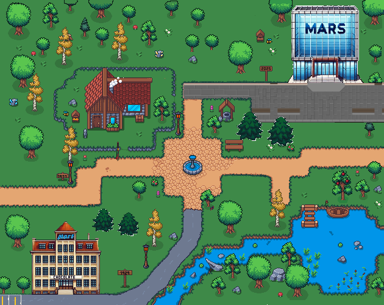

Fonte: Kenmi Pixel Art, alterações feitas (2025)

Descrição: Imagem do mapa atualizado, com os prédios de todas as fases implementadas.

 

2.3. SceneQuarto

Figura 25 - Cena do inicio do puzzle na cozinha

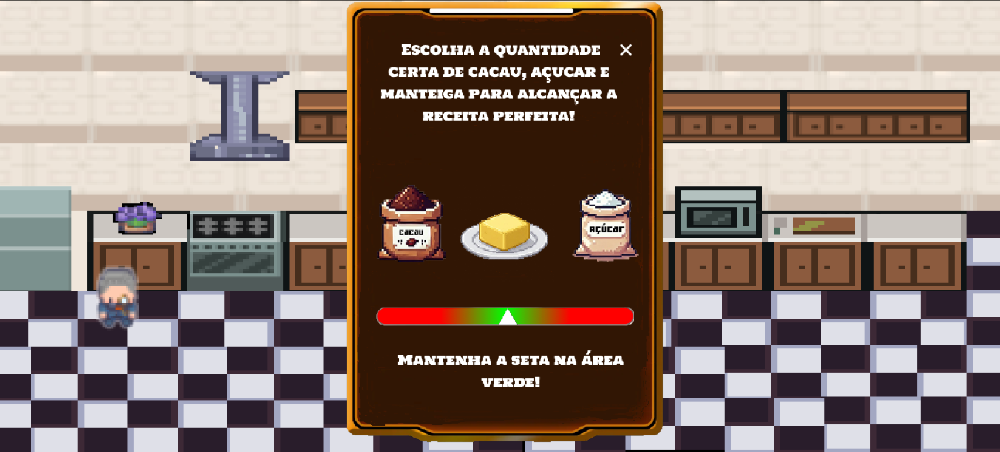

Fonte: Autoria própria (2025)

Descrição: Cena de início do puzzle de precisão com barra, nessa cena temos um pop-up com tutorial de como o puzzle funciona além das instruções dadas pelo NPC do Frank.

 

2.4. ScenePuzzleCozinhaCacau 

Figura 26 - Cena de seleção do cacau

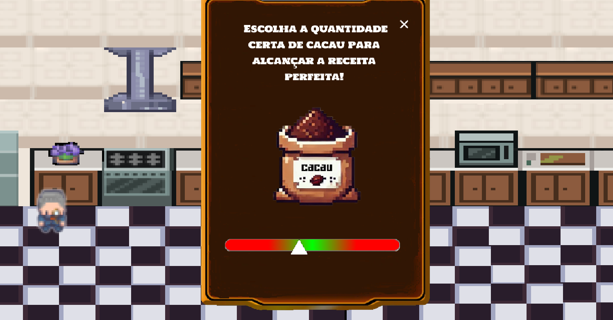

Fonte: Autoria própria (2025)
Descrição: Cena de seleção da quantidade de cacau.

 
 
2.5. ScenePuzzleCozinhaManteiga

Figura 27 - Cena de seleção da manteiga

Fonte: Autoria própria (2025)

Descrição: Cena de seleção da quantidade de manteiga.

 

2.6. Print 4: ScenePuzzleCozinhaAcucar (c)

Figura 28 - Cena de seleção do açúcar

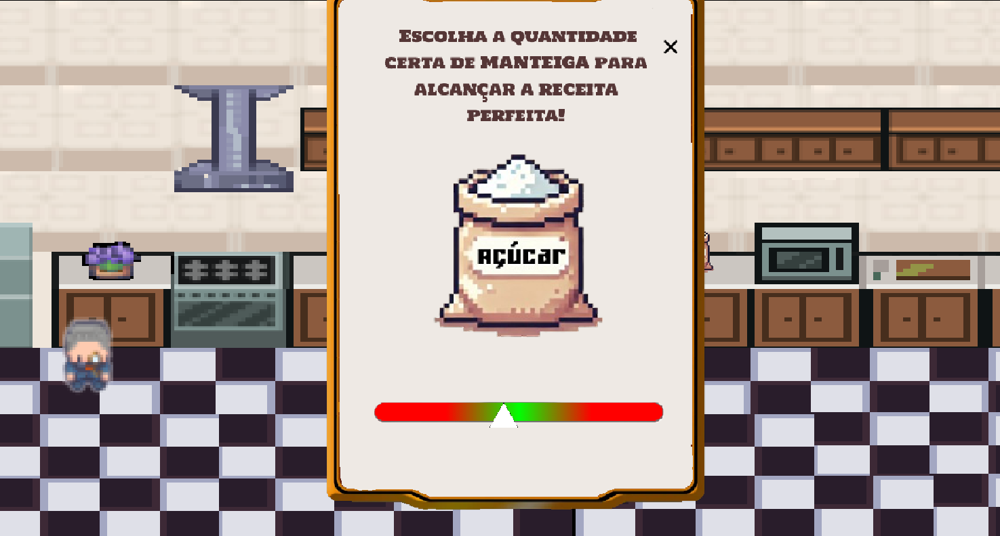

Fonte: Autoria própria (2025)

Descrição: Cena de seleção da quantidade de açúcar.

 

### 3. Entregas em Termos de Código

3.1. Navegação entre Cenas:
 Implementada transição de SceneInicial para Scenevia botão "Jogar":

De SceneJogo para SceneQuarto via botão invisível em (135, 420):

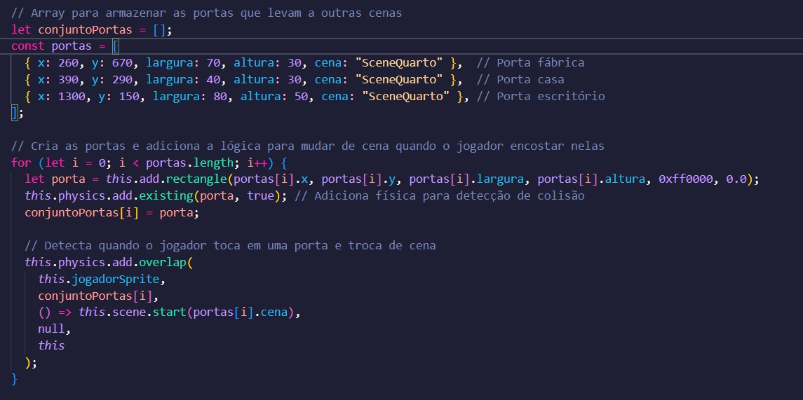

3.2. Interatividade: 

	Colisão de obstáculos com o personagem principal

#### 4. Dificuldades Enfrentadas

4.1. Caixa Preta no jogadorSprite: Na SceneQuarto, o sprite inicialmente aparecia como uma caixa preta até o movimento ser ativado. Resolvido ao definir um frame inicial ("frente0000") no create.

- Impacto: Exigiu ajustes na inicialização do sprite e verificação de texturas/animações.

4.2. Posicionamento de Colisores: Ajustar as coordenadas e tamanhos dos colisores em SceneQuarto para alinhar com o fundo (casab.png) foi trabalhoso, pois o layout não era intuitivo sem feedback visual direto.

- Impacto: Necessitou de testes iterativos para garantir bloqueios eficazes.

4.3. Transição de Cenas: Garantir que os recursos (atlas, animações) carregados na SceneJogo fossem reutilizados na SceneQuarto exigiu atenção à ordem de carregamento e nomenclatura consistente.

- Impacto: Pequenos ajustes na chave do atlas (jogadorAtlas vs. "boneco").

#### 5. Próximos Passos

5.1. Melhorar Feedback Visual:

- Adicionar indicadores visuais temporários (ex.: retângulos coloridos) para colisores e áreas de transição durante o desenvolvimento, removendo-os na versão final.

- Implementar animações ou sons para transições de cena.

5.2. Expandir Interatividade:

- Desenvolver a funcionalidade do botão "Configurações" na SceneInicial com uma cena dedicada (SceneConfig).

- Adicionar mais interações no quarto (ex.: objetos coletáveis ou NPCs adicionais).

5.3. Refinar Layout:

- Ajustar posições de colisores e áreas de transição com base em testes de jogabilidade e no design final do fundo.

- Otimizar o tamanho da tela e escalas para consistência entre cenas.

5.4. Testes e Depuração:

- Executar os casos de teste fornecidos para garantir robustez e corrigir eventuais bugs (ex.: falhas na transição ou colisões inconsistentes).

- Adicionar logs adicionais para monitorar o estado do jogo em tempo real.

## 4.4. Desenvolvimento final do MVP 

### Descrição do desenvolvimento 

Nesta etapa, o foco principal foi a finalização do MVP, com o objetivo de entregar um jogo que incorporasse suas principais características, atendendo tanto aos requisitos do parceiro quanto às análises e propostas desenvolvidas pelo grupo. Priorizamos o detalhamento e a finalização de todas as etapas relacionadas ao processo de contratação dentro do jogo, deixando-o pronto para testes e eventuais correções de bugs.

Durante a Sprint 4, refinamos o design e as mecânicas do jogo. Implementamos com sucesso o segundo puzzle e avançamos significativamente no desenvolvimento do Nível 3, que já se encontra praticamente finalizado. Obtivemos grandes avanços nos aspectos técnicos e mecânicos, além de melhorias visuais importantes — não exatamente mudanças, mas sim a concretização prática do que já havia sido planejado.

Esta sprint foi extremamente produtiva para a construção do jogo. Corrigimos diversos bugs e realizamos várias atualizações. No Nível 2, o jogo foi finalizado com sucesso, incluindo a criação de 50 cartas com personagens variados e um sistema de dupla escolha, projetado para refletir os valores e objetivos da empresa parceira.

No Nível 3, desenvolvemos o design do escritório da Mars, inspirado na identidade visual da empresa, com a inclusão de elementos como chocolates e pets. Além do visual, criamos a mecânica central desse nível: a formação de uma equipe de sucesso a partir da seleção de colaboradores apresentados por meio de pop-ups. Cada personagem possui habilidades e perfis únicos, e o sistema de escolha está funcional, permitindo testes completos por parte do jogador.

Ao final da sprint, tivemos a oportunidade de receber feedbacks valiosos de testers da própria Mars — em sua maioria, estagiárias, que representam nosso público-alvo. As devolutivas foram majoritariamente positivas, com sugestões pontuais que servirão para refinar ainda mais a experiência do jogo na versão final.

 ### Ilustrações de atualizações
 
 ##### Nível 2

Figura 29 - Tela do puzzle 2

Fonte: Autoria própria (2025)

 

No Nível 2, o jogo foi finalizado com sucesso, incluindo a criação de 50 cartas com personagens variados e um sistema de dupla escolha, projetado para refletir os valores e objetivos da empresa parceira. Neste ponto, o Jogo 2 encontra-se totalmente funcional, com o design completo e todas as mecânicas implementadas, pronto para testes e validações.

##### Nível 3 

Figura 30 - Tela do puzzle 3

Fonte: Autoria própria (2025)

 

Implementamos o design do Puzzle 3 totalmente alinhado à identidade da empresa Mars, incorporando diversos elementos gráficos que representam seus principais valores, produtos e cultura organizacional.
 
##### Puzzle nível 3 

Figura 31 - Tela do funcionamento do puzzle 3

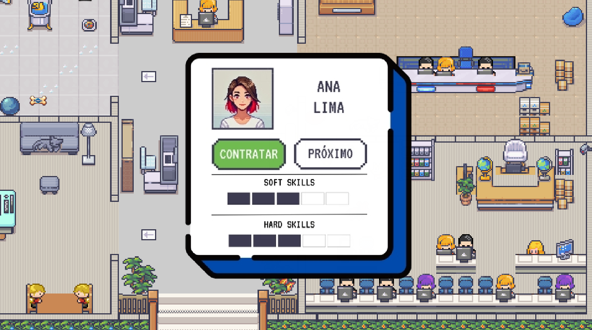

Fonte: Autoria própria (2025)

 

### Próximos Passos

Na próxima sprint, os principais objetivos serão o refinamento da movimentação e orientação do personagem no mapa principal, bem como a conclusão definitiva do Nível 3. Apesar de já estar funcional, esse nível ainda requer um encerramento mais claro, que evidencie a montagem de três equipes equilibradas para as áreas de atuação da Mars: Global Services, Petcare e Snacking.
Uma das principais dificuldades enfrentadas nesta etapa foi a aplicação correta das colisões nos mapas, especialmente devido à variação nos tamanhos de telas dos diferentes computadores utilizados nos testes. Esse problema gerou conflitos na jogabilidade, mas foi identificado e corrigido antes do encerramento da sprint.

## 4.5. Revisão do MVP 

   &emsp;Na Sprint 5, concentramos nossos esforços em todos os refinamentos que o MVP do nosso jogo ainda precisava. Demos atenção especial às orientações ao jogador, à finalização do Nível 3 e às definições sobre o pitch do projeto, que ficou sob responsabilidade de três integrantes do grupo. Esses membros se dedicaram aos ensaios e à apresentação final, além de realizarem uma revisão completa na nossa documentação, atualizando todos os registros do projeto.
A partir dos playtests realizados na Sprint 4, recebemos feedbacks valiosos que nos ajudaram a identificar os principais pontos de melhoria. Entre eles, destacaram-se os bugs a serem corrigidos e, especialmente, a necessidade de fornecer orientações mais claras sobre o caminho que o jogador deve seguir no mapa. Com base nesses retornos, implementamos setas indicativas nas portas principais do jogo e outras melhorias que tornaram a experiência mais intuitiva e imersiva.
Além dessas correções, também desenvolvemos e adicionamos a cena de créditos, conforme previsto no escopo do MVP. Com isso, nosso jogo agora possui início, meio e fim como prometido desde a primeira sprint.
Nosso jogo, com todas as atualizações realizadas, agora conta com:

##### Tela Inicial
Implementamos uma tela inicial funcional, com três botões: Entrar, Sair e Configurações, mantendo a proposta definida desde o início do projeto.
##### Tela de Instruções
Logo após iniciar o jogo, o jogador é direcionado a uma tela de instruções que segue o mesmo estilo visual do jogo. Nela, apresentamos um tutorial de movimentação e uma introdução ao funcionamento do gameplay.
##### Mapa Oficial do Jogo
Criamos um mapa oficial que reflete a narrativa do jogo, com placas informativas sobre os anos em que se passam as fases (1911, 1929 e 2025), além de edifícios representativos de cada período. O design foi inspirado em modelos da vida real, reforçando a identidade visual da marca e proporcionando maior imersão. O mapa passou por diversas melhorias ao longo das sprints, até alcançar um nível satisfatório para todos os membros da equipe e nossos parceiros. Agora, conta com indicações claras de navegação, setas indicativas e pop-ups instrutivos.
##### Puzzle 1 – Cozinha de 1911
O Nível 1 está totalmente funcional, com elementos de design cuidadosamente desenvolvidos e ajustados ao longo das sprints, garantindo uma boa experiência ao jogador.
##### Puzzle 2 – Fábrica de 1929
Na última entrega, apresentamos o Nível 2 finalizado, com todas as mecânicas e jogabilidade propostas implementadas. Após os testes com o parceiro, fizemos ajustes importantes, como a substituição de “valores” por “princípios” nos parâmetros principais do jogo e a implementação de feedbacks visuais antes da escolha ser concretizada, o que aprimorou ainda mais a coerência com os objetivos da empresa.
##### Puzzle 3 – Empresa Mars (2025)
O Nível 3 foi finalizado com sucesso, contendo mini-puzzles em cada setor: Global Services, Snacking e Petcare. Agora, o jogo também conta com um pop-up final, que avalia a performance das equipes formadas pelo jogador, oferecendo um feedback sobre a atuação do personagem Choco como gerente. Esse elemento foi um dos diferenciais que concluiu o jogo de forma envolvente e completa.
##### Cena Final
Na Sprint 5, implementamos a cena final, com um breve resumo da jornada vivida no jogo. Ela inclui os créditos com os nomes dos professores que nos orientaram durante o desenvolvimento, encerrando a experiência de forma profissional e respeitosa, com uma estética alinhada a todo o projeto.

##### Imagens das atualizações principais

Figura 32 - Tela de instruções de caminho no mapa oficial
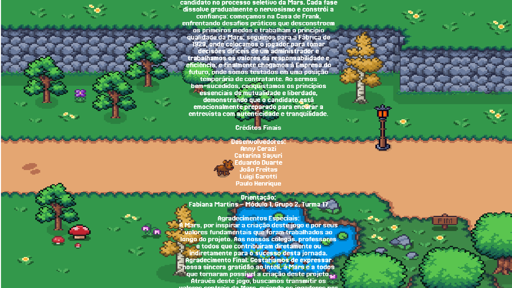
Fonte: Autoria própria (2025)

 Tela de instruções orientadas e atualizadas a cada progresso do jogador, implementação pedide pelos testers.
 
Figura 33 - Tela Final com créditos
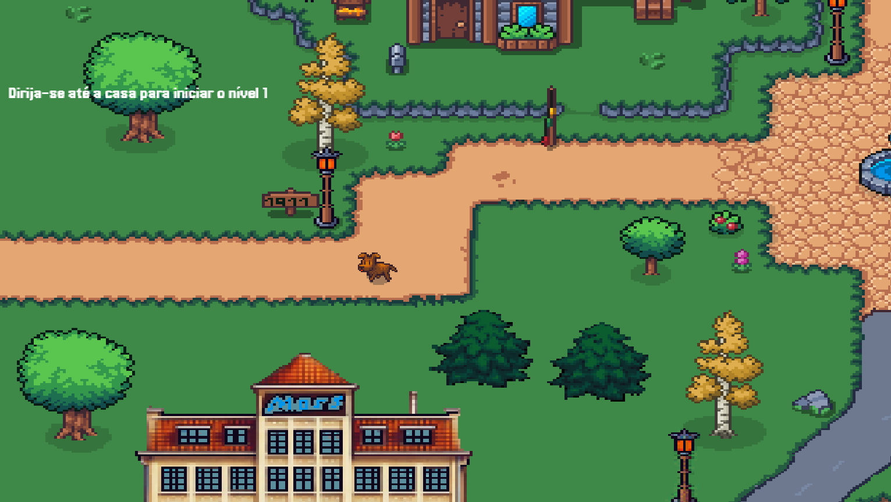

Fonte: Autoria própria (2025)

Tela final com créditos sobre a narrativa final do jogo e seus criadores.
##### Encerramento do Projeto
Ao final do desenvolvimento do MVP do projeto com a empresa Mars, por meio do jogo Do Cacau às Estrelas, nossa equipe está extremamente satisfeita com o protótipo entregue. Com muito comprometimento e dedicação, conseguimos cumprir todas as metas estabelecidas desde o início, oferecendo uma solução gamificada completa, funcional e alinhada com a proposta da empresa.

# 5. Testes

 Esta sessão de testes descreve procedimentos utilizados para verificar se as funcionalidades do jogo estão operando conforme o esperado. Eles ajudam a identificar erros, validar comportamentos e garantir uma experiência estável e consistente para o jogador.

## 5.1. Casos de Teste

### Tutorial

Tabela 3 - Casos de teste

| #  | **Pré-condição**                         | **Descrição do teste**                                    | **Pós-condição** |
|----|------------------------------------------|----------------------------------------------------------|------------------|
| 1  | Carregamento da Cena                    | Iniciar `SceneTutorial`                                  | Cena carregada corretamente |
| 2  | Exibição do Fundo                       | Verificar se o fundo aparece corretamente               | Fundo visível e na posição correta |
| 3  | Movimento do Jogador                    | Usar teclas direcionais para mover o personagem         | Personagem se move conforme esperado |
| 4  | Animações do Jogador                    | Mover o jogador em todas as direções                    | Animações correspondem ao movimento |
| 5  | Colisão com Obstáculos                  | Tentar atravessar barreiras invisíveis                  | Personagem não atravessa obstáculos |
| 6  | Interação com NPC                       | Aproximar-se do NPC e clicar nele                       | Caixa de diálogo aparece corretamente |
| 7  | Popup do NPC                            | Aproximar-se do NPC sem clicar                          | Popup aparece quando jogador está perto |
| 8  | Fechamento do Popup                     | Afastar-se do NPC                                        | Popup desaparece corretamente |
| 9  | Transição pela Porta                    | Mover-se até a porta da fábrica e atravessá-la          | Transição para `SceneJogo` ocorre corretamente |
| 10 | Diálogo do NPC                          | Clicar no NPC múltiplas vezes                           | Caixa de fala aparece e desaparece corretamente |
| 11 | Posicionamento da Câmera                | Mover o jogador pela cena                               | Câmera segue o jogador corretamente |
| 12 | Zoom da Câmera                          | Verificar o nível de zoom                               | Zoom ajustado conforme especificado |
| 13 | Carregamento de Imagens                 | Verificar NPC e sprites                                | Nenhuma imagem ausente ou corrompida |

### Cena do mapa

| #  | Pré-Condição | Descrição do Teste | Pós-Condição |
|----|-------------|--------------------|--------------|
| 1  | O jogo está carregado e o jogador está na cena inicial | Mover o personagem usando as teclas W, A, S, D e setas direcionais | O personagem se move corretamente em todas as direções |
| 2  | O jogo está carregado e o jogador está na cena inicial | Tentar sair dos limites do mapa | O personagem não atravessa as bordas do mapa |
| 3  | O jogo está carregado e o jogador está na cena inicial | Aproximar-se da casa de Franklin Mars | O popup com a fala inicial do NPC aparece corretamente |
| 4  | O popup do NPC está visível | Clicar no popup para avançar o diálogo | O texto do popup muda para a próxima mensagem ou desaparece no final |
| 5  | O jogo está carregado e o jogador está na cena inicial | Chegar próximo dos edifícios | A caixa de diálogo aparece com a mensagem do NPC |
| 6  | O diálogo do NPC está visível | Clicar fora da caixa de diálogo | A caixa de diálogo fecha corretamente |
| 7  | O jogo está carregado e o jogador está próximo a uma porta | Colidir com uma porta | O jogador é transportado para a cena correspondente |
| 8  | O jogo está carregado e os obstáculos foram criados | Tentar atravessar um obstáculo invisível | O personagem não atravessa os obstáculos |
| 9  | O jogo está carregado e o NPC Franklin Mars está na cena | Aproximar-se do NPC e sair de perto | O popup aparece ao se aproximar e desaparece ao se afastar |
| 10 | O jogo está carregado | Observar os logs do console durante o carregamento | Todas as imagens e sprites carregam corretamente, sem erros no console |
| 11 | O jogo está carregado | Mover-se sem pressionar teclas de movimento | O personagem permanece parado e não há animações ativas |
| 12 | O jogo está carregado e o personagem está em movimento | Parar de pressionar as teclas de movimento | O personagem para de se mover e a animação é interrompida |
| 13 | O jogo está carregado e as instruções estão sendo exibidas  | Intruções funcionais | Instruções funcionai, atualizando de acordo com o progresso do jogador pelo mapa |
| 14 | O jogo está carregado e a câmera está ajustada | Mover o personagem pelo mapa | A câmera segue o jogador corretamente sem sair dos limites |
| 15 | O jogo está carregado e a animação do jogador está configurada | Mover-se em diferentes direções | O jogador exibe a animação correta para cada direção |
|16| O jogo está carregado e a animação do jogador está configurada | Tenta entrar por outras portas a não ser o primeiro nível| Portas trancadas e abertas somente com o progresso do jogador.

### Primeiro Nível

| #  | **Pré-condição**                         | **Descrição do teste**                                    | **Pós-condição** |
|----|------------------------------------------|----------------------------------------------------------|------------------|
| 1  | Carregamento de Recursos                | Iniciar a `SceneQuarto` e verificar imagens              | Nenhuma imagem ausente ou corrompida |
| 2  | Exibição do Fundo                       | Iniciar `SceneQuarto` e verificar fundo                  | Fundo cobre toda a tela |
| 3  | Interação com Ingredientes              | Clicar nos ingredientes e verificar cenas                | Cada ingrediente abre a cena correta |
| 4  | Funcionamento do Popup de Tutorial      | Iniciar `SceneQuarto`, verificar popup e fechá-lo        | Popup desaparece ao clicar no botão |
| 5  | Movimentação da Seta                    | Observar seta, pressionar e soltar                | Seta para e continua corretamente |
| 6  | Mudança de Cena pela Porta              | Clicar na porta para sair da cena                        | Transição para `SceneJogo` |
| 7  | Exibição da Animação do Personagem      | Mover o personagem pela cena e observar animações        | Animação correta para cada direção |
| 8  | Colisão com Paredes                     | Mover personagem até as bordas da cena                   | Personagem não atravessa paredes |
| 9 | Carregamento do Fundo (ScenePuzzleCozinha) | Abrir `ScenePuzzleCozinha` e verificar fundo            | Fundo centralizado corretamente |
| 10 | Funcionamento do Botão de Fechar (ScenePuzzleCozinha) | Abrir cena e clicar no botão de fechar          | Cena fechada corretamente |
| 11 | Exibição da Imagem do Puzzle (ScenePuzzleCozinhaAcucar) | Abrir `ScenePuzzleCozinhaAcucar` e verificar fundo | Imagem aparece corretamente |11
| 12 | Funcionamento do Botão de Fechar (ScenePuzzleCozinhaAcucar) | Abrir cena e clicar no botão de fechar          | Cena fechada corretamente |
| 13 | Exibição da Imagem do Puzzle (ScenePuzzleCozinhaManteiga) | Abrir `ScenePuzzleCozinhaManteiga` e verificar fundo | Imagem aparece corretamente |
| 14 | Funcionamento do Botão de Fechar (ScenePuzzleCozinhaManteiga) | Abrir cena e clicar no botão de fechar          | Cena fechada corretamente |
| 15 | Funcionamento da Barra de Precisão | Clicar na tecla "espaço" | Flecha para exatamente na posição onde estava no momento em que "espaço" foi pressionado |
| 16 | Funcionamento da Barra de Precisão | Clicar na tecla "espaço" | Pontos são contabilizados, caso o jogador acerte o timing da barra |

Fonte: Autoria Própria (2025) 

###  Segundo Nível 

| #  | Pré-Condição | Descrição do Teste | Pós-Condição |
|----|-------------|--------------------|--------------|
| 1  | O jogo está carregado e o jogador está na cena inicial | Mover o personagem usando as teclas W, A, S, D e setas direcionais até a fábrica | O personagem se move corretamente em todas as direções e entra corretamente na cena 2 |
| 2  | Todos os assets do nível carregados | Imagem de fundo vísivel e diferentes cartas na tela| Todos os assets foram carregados corretamente, cartas vísiveis e variadas conforme escolha |
| 3  | O jogo está carregado e clica em arrastar cartas | testar se as cartas trocam e se movimentam para ambos os lados| Cartas funcionais, sendo possível serem arrastadas para a direita e esquerda, trocando a carta logo em seguida |
| 4  |Parâmetros vísiveis e funcionais| Atualização constante dos parâmetros de acordo com às escolhas | Todos os parâmetros funcionais com atualização a cada escolha diferente imposta pelas cartas. |

Fonte: Autoria Própria (2025) 

### Terceiro Nível

| #  | Pré-Condição | Descrição do Teste | Pós-Condição |
|----|-------------|--------------------|--------------|
| 1  | O jogo está carregado com todos os cenários e tilesets carregados| Ao entrar na scene Escritório todos os design estão sendo exibidos corretamente sem erros| Todos os cenários estão sendo carregados corretamente com todos os elementos visuais propostos |
| 2  | jogador na tela | O jogador se move no cenário | Jogador se movimenta corretamente pelo cenário|
| 3 | Colisões nos objetos | Testar se todas as colisões do cenário estão funcionais e se personagem não atravessa| Colisões funcionando perfeitamente, personagem não ultrapassa nenhum objeto do cenário|
| 4 | Pop - up de instruções| Testar se ao entrar na ala de recepção o pop-up aparece corretamente explicando como funciona o nível | Pop-up aparecendo perfeitamente funcional, com instruções claras e aparecendo e saindo corretamente.
| 5 |  Cartas de personagem variadas e funcionais | Testar se nos mini-puzzles estão trocando os possíveis colaboradores e se botões contratar e pular estão funcionais | Cartas variadas com botões funcionais de próximo e contratar totalmente funcionais.
| 6 | Pop - up aparecendo | Testar se após concluir as contratações dos 3 mini - puzzles aparece corretamente o pop-up final com feedback e avaliação de desempenho | Funcionando perfeitamente dando feedback e mostrando desempenho.

Fonte: Autoria Própria (2025) 

## 5.2. Testes de jogabilidade (playtests)

De forma geral, os casos de teste são testes aplicados ao jogo com o objetivo de evitar erros e confirmar que tudo está funcionando como deveria. Eles são compostos por perguntas-chave sobre a jogabilidade, com foco em identificar pontos de melhoria, demonstrar a finalidade de cada funcionalidade, como ela pode ser aplicada no jogo e qual efeito se espera reproduzir.

### 5.2.1 Registros de testes

Tabela 4 - Registros de testes

\# | Teste 1
--- | ---
**Teste conduzido por** | Catarina, Paulo, Eduardo
**Tester** | Luiza (Recursos Humanos)
**Idade** | 28
**Local** | Instituto de Tecnologia e Liderança
**Dia** | 28 de março de 2025
**Duração** | 15 minutos
**Dispositivo** | Notebook da Catarina
Já possuía experiência prévia com games? | sim, é um jogador casual
Conseguiu iniciar o jogo? | sim
Entendeu as regras e mecânicas do jogo? | Sim, leu os pop-up e se dirigiu corretamente através das cenas.
Conseguiu progredir no jogo? | sim, teve  dificuldades apenas em questão de orientação no mapa. 
Apresentou dificuldades? | Parcialmente, gostou bastante do puzzle 2 mas não conseguiu concluir no tempo esperado. 
Que nota deu ao jogo? | 9.0
O que gostou no jogo? | Gostou bastante da estética do jogo, e de todas as mecânicas dos puzzle, e de como o jogo se ligou na história da empresa.
O que poderia melhorar no jogo? | Ter orientação de onde ir no mapa principal, demonstrar onde é cada fase, ter a funcionalidade de voltar pop-ups, e movimentação do personagem mais rápido na tela de instrução.

Fonte: Autoria Própria (2025) 

Tabela 5 - Registros de testes
\# | Teste 2
--- | ---
**Teste conduzido por** | Catarina, Paulo, Eduardo
**Tester** | Ana (Estagiária na área Corporate Affairs na Mars)
**Idade** | 21 anos
**Local** | Instituto de Tecnologia e Liderança
**Dia** | 28 de março de 2025
**Duração** | 13 minutos
**Dispositivo** | Notebook da Catarina
Já possuía experiência prévia com games? | sim, é um jogador casual
Conseguiu iniciar o jogo? | sim
Entendeu as regras e mecânicas do jogo? | sim, sem dificuldades no tempo esperado.
Conseguiu progredir no jogo? | sim, conseguiu concluir todas as fases do jogo.
Apresentou dificuldades? | Teve dificuldades de se localizar no mapa tendo dificuldades para entrar na casa do nível 1.
Que nota deu ao jogo? | 9.0
O que gostou no jogo? | Gostou da ordem cronológica da história e da dinâmica dos puzzle, elogiou a estética do jogo e a sequência.
O que poderia melhorar no jogo? | O feedback foi em quesito da orientação no mapa principal, que ainda está confuso para qual caminho seguir.

Fonte: Autoria Própria (2025) 

Tabela 6 - Registros de testes

\# | Teste 3
--- | ---
**Teste conduzido por** | Catarina, Paulo, Eduardo
**Tester** | Luiz ( Trabalha na área de Recursos Humanos na Mars)
**Idade** | 31 anos
**Local** | Instituto de Tecnologia e Liderança
**Dia** | 28 de março de 2025
**Duração** | 12 minutos
**Dispositivo** | Notebook do Luigi
Já possuía experiência prévia com games? | sim, é um jogador casual
Conseguiu iniciar o jogo? | sim
Entendeu as regras e mecânicas do jogo? | sim, sem dificuldades no tempo esperado.
Conseguiu progredir no jogo? | sim, conseguiu concluir todas as fases do jogo, sem dificuldades de progressão.
Apresentou dificuldades? | Apresentou dificuldades para se locomover no mapa, sem muita direção, mas nos puzzles conseguiu bom desempenho.
Que nota deu ao jogo? | 9.0
O que gostou no jogo? | Gostou de todo o conjunto estético, como os aspectos gráficos inspirados na empresa, gostou da forma que a história está ligada aos princípios da empresa, elogiou bastante o puzzle 3.
O que poderia melhorar no jogo? | O feedback foi em quesito da orientação no mapa principal, e aumentar um pouco a dificuldade do nível 1.

Tabela 7 - Registros de testes

\# | Teste 4
--- | ---
**Teste conduzido por** | João, Anny, Luigi
**Tester** | Jade (Analista de Employer Branding)
**Idade** | 24 anos
**Local** | Instituto de Tecnologia e Liderança
**Dia** | 28 de março de 2025
**Duração** | 25 minutos
**Dispositivo** | Notebook do Luigi
Já possuía experiência prévia com games? | sim, básica
Conseguiu iniciar o jogo? | sim
Entendeu as regras e mecânicas do jogo? | Razoavelmente, teve dificuldades principalmente em entender as mecânicas do nível 2 e 3.
Conseguiu progredir no jogo? | Razoavelmente, precisou de auxílio para entender como funcionava os puzzle, demorando mais que o esperado para completar e progredir os níveis.
Apresentou dificuldades? | Apresentou dificulades para se locomover no mapa, não se leu as instruções dos pop-ups o que dificultou muito a jogabilidade deixando confusa. Mas após orientação entendeu como funcionava.
Que nota deu ao jogo? | 9.0
O que gostou no jogo? | Gostou de todo o conjunto estético, como os aspectos gráficos inspirados na empresa, gostou da forma que a história está ligada aos princípios da empresa, elogiou bastante o puzzle 3.
O que poderia melhorar no jogo? | Uma melhor visualização das opções das cartas no nível 2, orientação no mapa principal, e indicações de onde entrar nos níveis.

Fonte: Autoria Própria (2025) 
 Tabela 8 - Registros de testes

\# | Teste 5
--- | ---
**Teste conduzido por** | Anny, Luigi, João
**Tester** | Leticia (Estagiária na Mars)
**Idade** | 27 anos
**Local** | Instituto de Tecnologia e Liderança
**Dia** | 28 de março de 2025
**Duração** | 16,5 minutos
**Dispositivo** | Notebook do Luigi
Já possuía experiência prévia com games? | sim, jogadora casual
Conseguiu iniciar o jogo? | sim
Entendeu as regras e mecânicas do jogo? | Razoável, demorou mais que o esperado para entender o puzzle 2, nos demais níveis conseguiu entender bem e com tempo menor.
Conseguiu progredir no jogo? | Teve dificuldade para entrar na casa mesmo após ler o pop-up, mas as mecânicas do nível 1 não teve dificuldade, já no segundo nível demorou bastante para entender a mecânica e demorou mais que o esperado não concluindo o nível. No nível 3 teve dificuldades pois foi direto para os mini games sem ler as instruções.
Que nota deu ao jogo? | 8.5 
O que gostou no jogo? | Gostou do jeito que construímos o jogo em função dos 5 princípios da empresa, gostou da interface visual do mapa e dos níveis. Elogiou a dinâmica do jogo e a ideia de ser cronológico.
O que poderia melhorar no jogo? | Fornecer uma orientação mais clara sobre para onde o jogador deve se dirigir primeiro, com estilo barra de missões e setas indicativas tornar o nível dois mais compreensível e objetivo, e reduzir a quantidade de cartas exigidas.

Fonte: Autoria Própria (2025) 

 Tabela 9 - Registros de testes

\# | Teste 6
--- | ---
**Teste conduzido por** | Anny, Luigi, João
**Tester** | Milena (Estagiária de Marketing da royal canin)
**Idade** | 22 anos
**Local** | Instituto de Tecnologia e Liderança
**Dia** | 28 de março de 2025
**Duração** | 22 minutos
**Dispositivo** | Notebook do Luigi
Já possuía experiência prévia com games? | sim, jogadora casual
Conseguiu iniciar o jogo? | sim
Entendeu as regras e mecânicas do jogo? | Razoável, demorou mais que o esperado para entender o puzzle 2, nos demais níveis conseguiu entender perfeitamente.
Conseguiu progredir no jogo? | No primeiro nível sim, sem qualquer dificuldade, já no segundo nível demorou bastante para entender a mecânica e demorou mais que o esperado não concluindo o nível. No nível 3 teve dificuldades pois foi direto para os mini games sem ler as instruções.
Que nota deu ao jogo? | 8.5 
O que gostou no jogo? | Gostou do jeito que construimos o jogo em função dos 5 principios da empresa, gostou da interface visual do mapa e dos níveis.
O que poderia melhorar no jogo? | Fornecer uma orientação mais clara sobre para onde o jogador deve se dirigir primeiro, tornar o nível dois mais compreensível e objetivo, e reduzir a quantidade de cartas exigidas.

Fonte: Autoria Própria (2025) 

### 5.2.2 Melhorias

&emsp;A partir dos testes de jogabilidade realizados, foi possível identificar diversos pontos de melhoria que devem ser implementados e refinados na fase final de desenvolvimento do jogo. Com base nas observações dos participantes, as principais melhorias a serem aplicadas são:

##### Melhorar a orientação no mapa principal
Muitos testers relataram dificuldade em se localizar e entender para onde deveriam ir. Por isso, na sprint 5, implementamos orientações visuais e setas indicativas, o que melhorou significativamente esse aspecto.

Permitir que os pop-ups possam ser revisitados 

#####  Permitir que os pop-ups possam ser revisitados
Alguns jogadores perderam instruções importantes por não lerem os pop-ups ou por não conseguirem revisá-los posteriormente. Para resolver isso, implementamos uma funcionalidade que permite pular e voltar os pop-ups, melhorando a interação do jogador com as instruções do jogo.

##### Aprimorar a clareza do nível 2 
O segundo nível foi considerado o mais confuso e difícil pelos jogadores. Para melhorar essa etapa, utilizamos letras mais chamativas nas escolhas, reduzimos a quantidade de cartas e adicionamos uma nova mecânica que indica a quantidade de impacto que cada parâmetro receberá após a escolha do jogador.

##### Ajustar a velocidade de movimentação do personagem
Houve relatos de lentidão na movimentação do personagem, especialmente nos trechos introdutórios. Ajustamos a velocidade, tornando a navegação mais rápida e intuitiva.

##### Ajustar a curva de dificuldade entre os níveis
A progressão entre os níveis foi considerada abrupta por alguns testers, principalmente entre o primeiro e o segundo. Com base nesse feedback, aumentamos a velocidade da barra de precisão no nível 1, equilibrando melhor a dificuldade entre as fases.

# 6. Conclusões e trabalhos futuros

&emsp;Nossa solução gamificada atingiu com êxito os objetivos definidos na Seção 1 deste documento. Com uma abordagem centrada no usuário, acessível via web e com controles simples e intuitivos, conseguimos proporcionar uma experiência de jogo envolvente e fluida. A criação do personagem Choco, aliada à variedade de interações disponíveis, oferece aos jogadores uma sensação real de imersão, permitindo a exploração livre por três fases distintas, cada uma ambientada em diferentes momentos históricos da trajetória da empresa.
&emsp;A inclusão de puzzles, quizzes e conteúdos informativos sobre a história da Mars fortaleceu o caráter educacional do jogo. Essa narrativa, organizada de forma cronológica, destacou os principais valores da organização, preparando os jogadores com um conhecimento mais aprofundado para os processos seletivos. Os pop-ups variados e as instruções claras ao longo do caminho garantiram uma experiência acessível e inclusiva, permitindo que todos os participantes se sentissem acolhidos e bem orientados.

##### Aplicação dos Objetivos do Projeto no Jogo
Desde o início, buscamos representar, em cada fase, um ou mais princípios da Mars:

- Fase 1: Foco no princípio da Qualidade, destacando sua importância como pilar fundamental da empresa.

- Fase 2: Incorporação dos princípios de Responsabilidade e Eficiência, reforçando a relevância desses valores na formação de um colaborador ideal.

- Fase 3: Apresentação dos princípios de Mutualidade e Liberdade, evidenciando como esses conceitos são valorizados no processo de contratação e no ambiente de trabalho da Mars.

&emsp;Esses objetivos foram implementados com sucesso em cada puzzle, envolvendo os jogadores de forma significativa e proporcionando uma experiência cativante e diversificada. Além disso, o conteúdo do jogo abordou, de maneira dinâmica e eficiente, as principais etapas e conceitos que os candidatos precisam vivenciar durante o processo seletivo da Mars, promovendo uma compreensão mais profunda por meio da gamificação.

##### Pontos Fortes
- Interface acessível e intuitiva.

- Narrativa imersiva com forte apelo visual e educacional.

- Representação clara e coerente dos valores da Mars em cada fase.

- Conteúdo informativo integrado à jogabilidade.

- Design centrado no usuário e experiência inclusiva.
- Design representativo da empresa e com sua identidade visual.

##### Pontos de Melhoria e Plano de Ação

&emsp;Durante os testes e feedbacks recebidos, foram identificadas oportunidades de aprimoramento. Abaixo, relacionamos os pontos de melhoria e suas respectivas ações sugeridas:

Tabela 9 - melhorias e ações.
| **Ponto de Melhoria**                               | **Plano de Ação Sugerido**                                                                 |
|-----------------------------------------------------|---------------------------------------------------------------------------------------------|
| Poucas fases disponíveis                            | Desenvolver novas fases com diferentes desafios e simulações, como entrevistas e dinâmicas de grupo. |
| Experiência visual                          | Adicionar mais elementos gráficos relacionados à identidade visual da Mars para enriquecer a estética do jogo. |
| Limitações em dispositivos móveis                   | Otimizar o jogo para celulares e tablets, garantindo responsividade e bom desempenho.       |
| Falta de personalização do avatar                   | Permitir a customização do personagem Choco, aumentando o vínculo emocional e a imersão dos jogadores. |
| Baixa interação com personagens secundários         | Incluir NPCs no mapa oficial com falas e interações contextualizadas.                      | |
| Navegação limitada                                  | Adicionar um modo de tela cheia para melhor imersão.                                       |
| Mecânica de jogo na Fase 2            | Inserir cartas com diferentes probabilidades e parâmetros, aumentando a complexidade estratégica. |

Fonte: Autoria Própria (2025) 

##### Ideias para Melhorias Futuras
&emsp;À medida que o desenvolvimento de jogos evolui, é essencial reconhecer que a inovação e o aprimoramento são contínuos. No contexto da criação de Do Cacau às Estrelas, um jogo desenvolvido exclusivamente para o processo seletivo da Mars, é possível que ocorram mudanças e atualizações nesse processo. Sendo assim, o jogo também pode ser ajustado para acompanhar essas transformações, elevando ainda mais a experiência dos jogadores e garantindo que continue atendendo às expectativas dos futuros colaboradores da empresa.
A seguir, listamos uma série de melhorias futuras que podem ser implementadas para enriquecer a jogabilidade, a acessibilidade e a relevância do jogo:

- Expansão da linha do tempo do jogo com novos eventos históricos da Mars.

- Integração com plataformas de recrutamento.

- Adição de conquistas e recompensas para incentivar a progressão dos jogadores.

- Criação de rankings internos e desafios em grupo.

- Tradução do jogo para outros idiomas, ampliando o alcance internacional.

- Criar uma área administrativa onde recrutadores possam acessar relatórios de desempenho dos candidatos.

- Integração com plataformas de recrutamento (ex: Gupy, LinkedIn)

# 7. Referências

1. ASSOCIAÇÃO BRASILEIRA DA INDÚSTRIA DE ALIMENTOS. Mars. Disponível em: https://abra.ind.br/associados/mars/. Acesso em: 18 fev. 2025.

2. GOVERNADOR DO ESTADO DE SÃO PAULO. Mars anuncia investimento de R$ 750 milhões no estado de São Paulo. Disponível em: https://www.investe.sp.gov.br/noticia/mars-anuncia-investimento-de-r-750-milhoes-no-estado-de-sao-paulo/. Acesso em: 18 fev. 2025.

3. LINKEDIN. Mars. Disponível em: https://br.linkedin.com/company/mars. Acesso em: 21 fev. 2025.

4. LUANDA. A Mars realiza estudo global sobre tutores de pets para entender melhor as necessidades e comportamento. Disponível em: https://www.luanda.com.br/post/a-mars-realiza-estudo-global-sobre-tutores-de-pets-para-entender-melhor-as-necessidades-e-comportame. Acesso em: 18 fev. 2025.

5. MUNDO DAS MARCAS. Mars: Every Day, New Idea. Disponível em: https://mundodasmarcas.blogspot.com/2006/06/mars-every-day-new-idea.html. Acesso em: 18 fev. 2025.

6. MARS. Our Brands. Disponível em: https://www.mars.com/pt-br/our-brands. Acesso em: 20 fev. 2025.

7. UOL ECONOMIA. Família Mars se mantém na liderança do ranking das maiores fortunas do mundo. Disponível em: https://economia.uol.com.br/noticias/redacao/2024/09/11/familia-mars.htmm. Acesso em: 20 fev. 2025.

8. WIKIPEDIA. Mars, Incorporated. Disponível em: https://pt.wikipedia.org/wiki/Mars,_Incorporated. Acesso em: 20 fev. 2025.

9. MARS. About. Disponível em: https://www.mars.com/about. Acesso em: 4 abr. 2025.

10. MARS. Five Principles. Disponível em: https://www.mars.com/about/five-principles. Acesso em: 4 abr. 2025.

11. MARS. Careers. Disponível em: https://careers.mars.com. Acesso em: 6 abr. 2025.

12. MARS. History. Disponível em: https://www.mars.com/about/history. Acesso em: 6 abr. 2025.

